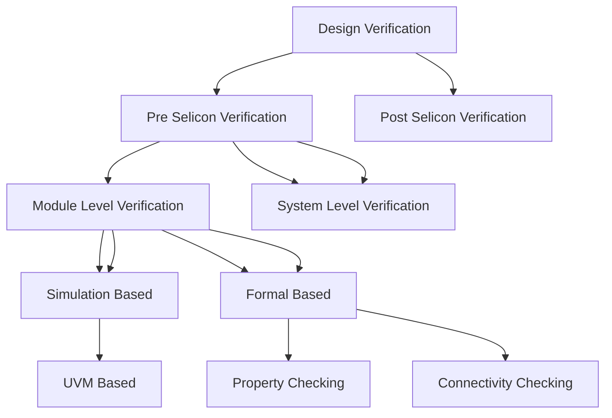

## 2026-04-01

## What is Design Verification

**Module level verification:** Η διαδικασία κατά την οποία εξετάζουμε την ορθότητα των επί μέρους modules ενός DUT.

Αφού γίνει αυτή η διαδικασία (για τα περισσότερα ή όλα τα modules) μετά περνάμε στην **System Level Verification**




## Βασικά Components


### DUT - Device/Design Under Test

**DUT** είναι η συσκευή (chip ή module) που θέλουμε να ελέγξουμε

### Model

**Model** είναι μία συνάρτηση που προσωμοιώνει την λειτουργία του **DUT** μέσω κώδικα. 

### Scoreboard

**Scoreboard** συγκρίνει τα δεδομένα ανάμεσα στο **model** και στο **DUT**.
    Στόχος μας είναι να βρούμε κατάλληλες εισόδους έτσι ώστε να έχουμε διαφορά ανάμεσα σε **DUT** και **Model**. 

# Device Under Test - Ανάλυση Χαρακτηριστικών

Το DUT που θα μελετηθεί είναι **Aligner**


## Interface - Διεπαφή

### Παράμετροι

Ο **Aligner** έχει δύο βασικές **παραμέτρους**:

- **ALIGN_DATA_WIDTH** -> Το μήκος του ***data bus*** με το οποίο λαμβάνονται τα ***unaligned data - md_rx_data*** και στέλνονται τα ***aligneed data - md_tx_data***. (deault = 32)

- **FIFO_DEPTH** -> Το βάθος των δίδο ***FIFO*** για την διαχείριση των δεδομένων (default = 8)

### Διεπαφή

Χρησιμοποιούνται δύο τύποι διεπαφών:

- **AMBA 3 APB** για τους καταχωρητές
- **2 Interfaces** με κοινή MD (Memory Data):
    - **RX** διεπαφή για να λαμβάνει δεδομένα
    - **ΤΧ** διεπαφή για να στέλνει δεδομένα   


## Registers - Καταχωρητές

Το **module** έχει 4 καταχωρητές:

|       | Offset | Name                               |
|:-----:|:------:|------------------------------------|
| CTRL  | 0x0000 | Control Register                   |
| STATUS| 0x000C | Status Register                    |
| IRQEN | 0x00F0 | Interrupt Requests Enable Register |
| IRQ   | 0x00F4 | Interrupt Request Register         |


- **CTRL**: Έχει τρεις βασικές λειτουργίες:
    
    - Να ελέγχει το μέγεθος των ***aligned data***. Αν πάρει 0 βγάζει APB Error
    - Να ελέγχει το offset των ***aligned data***.
        - Αν το ζεύγος (Size, Offset) είναι λάθος επιστρέφει APB Error
    - Να σβήνει τον ***Status counter*** (COUNT_DROP) 

- **STATUS**: Περιέχει πληροφορίες για την τωρινή κατάσταση του module:
    - Αριθμός των ***unaligned*** προσβάσεων
        - Πρέπει να γίνουν dropped, Όταν φτάσουν στην μέγιστη τιμή δεν κάνει wrap ο counter
    - Το επίπεδο πλήρωσης (fill level) της RX FIFO
    - Το επίπεδο πλήρωσης της TX FIFO
        - Τα επίπεδα αφορούν το μέγεθος των transactions και όχι των byte. Με άλλα λόγια εάν μία είσοδος αποτελείται είτε από 1, 2, 4 byte ο counter θα αυξηθεί κατά 1.

- **IRQEN**: Περιέχει bits που επιτρέπουν κάθε ξεχωριστό interrupt
    - RX_FIFO_EMPTY
    - RX_FIFO_FULL
    - TX_FIFO_EMPTY
    - TX_FIFO_FULL
    - MAX_DROP

- **IRQ**: Περέχει την κατάσταση κάθε available interrupt
    - RX_FIFO_EMPTY
    - RX_FIFO_FULL
    - TX_FIFO_EMPTY
    - TX_FIFO_FULL
        - Αυτά είναι sticky. Εάν γίνουν clear δεν θα γίνουν set μέχρι η FIFO να φτάσει σε αυτή την κατάσταση πάλι
    - MAX_DROP 
        - STATUS.CNT_DROP φτάνει την μέγιστη τιμή (sticky).  

## Functionality - Λειτουργικότητα

Στην εικόνα παρακάτω βλέπουμε για ALIGN_DATA_WIDTH = 32 το πώς λειτουργεί το κύκλωμα για διαφορετικά ζεύγη (SIZE, OFFSET).


### RX Controller

1ον μπορεί να ανακόψει την εισροή δεδομένων όταν η RX_FIFO είναι γεμάτη μέσω του ***md_rx_ready = 0***.

2ον καθορίζει εάν μία εισερχόμενη MD transfer είναι νόμιμη:

- $ (\frac{ALIGN\_DATA\_WIDTH}{8} + offset) \% size  =0$ 

Σε αυτή την περίπτωση επιστρέφει  (***md_rx_err = 1***) και ο drop counter αυξάνεται κατά 1, εάν δεν έχει φτάσει στην μέγιστη τιμή. Εάν είναι στην μέγιστη τιμή δεν αυξάνεται περαιτέρω και θα ξαναμηδενίσει όταν ***CTRL.CLR = 1***.
- Πάντα όταν φτάνει στην μέγιστη τιμή ο counter παράγεται ένα interrupt. Όταν συμβεί αυτό το ***IRQ.MAX_DROP = 1*** θα μείνει μέχρι να γίνει cleared.

### RX FIFO

Αποθηκεύει δεδομένα μέχρι ο Controller να μπορεί να τα απορροφήσει. Το fill level υπάρχει στο ***STATUS.RX_LVL***.

### Controller 

Όποτε η **RX_FIFO** έχει δεδομένα τα απορροφά κάνει το allignment και τα περνά στην **TX_FIFO**. Εάν η **TX_FIFO** είναι γεμάτη περιμένει να αδειάσει για να συνεχίσει.

### TX FIFO 

Λειτουργεί ακριβώς αντίστοιχα με την RX_FIFO

### TX Controller 

Παίρνει δεδομένα από την **TX_FIFO** και τα στέλνει στο **md_tx interface**.

## Σχόλια

- Δεν έχει σημασία η αρχική θέση των **words**. Δηλαδή το γεγονός ότι ένα byte ήρθε στην θέση 2 για παράδειγμα, δεν σημαίνει ότι θα κατευθυνθεί στην θέση 2.

- Επιπλέον byte που δεν στάλθηκαν ξαναξεκινάνε από την θέση που ορίζει το **offset**.


# Environment Architecture


## Agent

**Agent** είναι έαν **uvm component** υπεύθυνο για τον έλεγχο ενός interface. Άρα από την μελέτη του **DUT** είναι προφανές ότι χρειαζόμαστε 3 **agents**.

### Βασική δομή ενός agent

Αποτελείται από:
- **Interface**

| Component | Ρόλος |
|:----------|:------|
| **Sequencer** | Ελέγχει την σειρά εκτέλεσης των βημάτων από ένα high-level αίτημα |
| **Driver** | Παίρνει τα abstract transactions του sequencer και τα μεταφράζει σε pin-level σήματα στο interface |
| **Monitor** | Παρακολουθεί παθητικά τα σήματα του interface και τα μετατρέπει πάλι σε abstract transactions για ανάλυση |
| **Coverage** | Συλλέγει μετρικές για το πόσο καλά έχουμε ελέγξει το DUT — καταγράφει ποιες καταστάσεις/συνδυασμοί έχουν εκτελεστεί |
| **Config** | Αποθηκεύει τις παραμέτρους ρύθμισης του agent (π.χ. active/passive mode, interface handle) και τις μοιράζει στα υπόλοιπα components |


## Testbench

Αρχικά στο **Testbench** εμπεριέχεται το **DUT**. Για να μπορεί να λειτουργήσει το **DUT**, χρειάζεται ακόμα:

- Clock Generator
- Initial Reset Generator
- UVM start logic: Συνήθως είναι απλά μία κλήση στην `run_test()`. Όταν καλείτε γίνονται τα εξής:
    - Αρχικοποιείται το UVM test
    - Ξεκινάνε τα **UVM phases**

### Αρχικοποίηση Test

Για να τρέξουμε το testbench με ένα test υπάρχουν 2 μέθοδοι:

<table style="width:100%; table-layout:fixed;">
<tr>
<th style="width:50%">Κώδικας Α</th>
<th style="width:50%">Κώδικας Β</th>
</tr>
<tr>
<td style="width:50%; vertical-align:top;">
<pre><code class="language-systemverilog">
module testbench();
  import uvm_pkg::*;

    initial begin
        run_test("cls_algn_test_reg_access");
    end
endmodule
</code></pre>
</td>
<td style="width:50%; vertical-align:top;">
<pre><code class="language-systemverilog">
module testbench();
  import uvm_pkg::*;

    initial begin
        run_test("");
    end
endmodule
</code></pre>
</td>
</tr>
</table>

Στον κώδικα Β προσθέτουμε  `+UVM_TESTNAME=cls_algn_test_reg_access` για να τρέξει σωστά στον simulator.
Γενικά ο **Κώδικας Β** είναι ο προτιμότετος
- @t 2026-04-03 Θέλει μεγάλη προσοχή να μην υπάρχει κενό ανάμεσα στ + και το UVM_TESTNAME.

### UVM Naming Conventions

- Ένα σχόλιο είναι ότι στην βιομηχανία είναι τυπικό ένα όνομα **testbench** να έχει την δομή, όπως `cls_algn_test_reg_access`:
    - Συντομογραφία ονόματος εταιρείας (`cls`)
    - Συντομογραφία ονόματος DUT (`algn`)
    - Το όνομα του test μετά

Προφανώς όλα τα tests πρέπει να κληρωνομούν από την `uvm_test` κλάση.

### Run UVM Phases

Κάθε **uvm test** έχει 9 **phases**:

| Phase | Συνάρτηση |
|-------|-----------|
| Build | `build_phase()` |
| Connect | `connect_phase()` |
| End of Elaboration | `end_of_elaboration_phase()` |
| Start of Simulation | `start_of_simulation_phase()` |
| Run | `run_phase()` |
| Extract | `extract_phase()` |
| Check | `check_phase()` |
| Report | `report_phase()` |
| Final | `final_phase()` |

Ουσιατικά με τον όρο **phases**, εννοούμε ορισμένες συναρτήσεις οι οποίες καλούνται με αυτή την συγκεκριμένη σειρά.

* Μόνο η `run_phase()` είναι **task** γιατί πρέπει να καταναλώνει χρόνο.
* Όλες αυτές οι κλάσεις κληρονομούν την `uvm_component`. Ομοίως όλες οι κλάσεις όπως το `uvm_test` και σχεδόν τα πάντα κληρονομούν από το `uvm_component`.

*  Όλα τα **components** υλοποιούνται στην `build_phase()`. Γενικά από όλα τα phases κυρίως χρησιμοποιούνται 3.
    * `build_phase()`
    * `connect_pahse()`
    * `run_phase()`

## Test

Κατά το **verification**, θα χρησιμοποιήσουμε πολλά διαφορετικά tests. Όλα αυτά θα κληρονομούν την `uvm_test` κλάση.

Επειδή όμως γενικά θέλουμε αυτά τα tests να έχουν και άλλα κοινά όπως το **Environment**, ορίζουμε και μία ενδιάμεση κλάση πχ
- `uvm_algn_test_base`


## 2026-04-02

# UVM implementation

Το project θα υλοποιηθεί με τη εκδοχή **UVM 1.2** με τα παρακάτω χρήσιμα links:

- [User Manual](https://www.accellera.org/images//downloads/standards/uvm/uvm_users_guide_1.2.pdf)

- [Class Reference](https://www.accellera.org/images/downloads/standards/uvm/UVM_Class_Reference_Manual_1.2.pdf)

Οι προσωμοιώσεις για αρχή θα γίνουν με το **EDA Playground**, με το εργαλείο **Cadence Xcelium 25.03**

## Testbench

Τρέχοντας τον παρακάτω κώδικα από μόνο του θα παρχθεί ένα `UVM_FATAL`, καθώς δεν έχουμε ορίσει ποια συνάρτηση θα καλέι με την `run_test()`. Για να δουλέψει σωστά χρειάζεται το κατάλληλο όρισμα στο **Run Options**, όπου για τώρα θα γράψουμε `UVM_TESTNAME=cfs_algn_test_reg_access`.

- @t 2026-04-03 Ιδιαίτερη προσοχή θέλουν οι εντολές που επιτρέπουν το να περνάμε τις τιμές των μεταβλητών σε αρχεία:
    - `$dumpfile(<όνομα αρχείου>);`
    - `$dumpvars;`
        - Για να δούμε τα αρχεία θα πρέπει να ενεργοποιήσουμε και το **Open EPWave after run**.

```sv
module testbench();
  
  import uvm_pkg::*;
  
  // --------------------- Clock Logic ---------------------
  reg clk;
  initial begin
    clk = 0;
   
    forever begin
      clk = #5ns ~clk; // f = 100Mhz
    end
    
  end
  
  // --------------------- Reset Logic ---------------------
  
  reg reset_n;
  initial begin
    
    reset_n = 1;
    
    #6ns; reset_n = 0;
    
    #30ns; reset_n = 1;
    
  end
  
  // --------------------- Call to test ---------------------
  
  initial begin

    $dumpfile("dump.vcd");
    $dumpvars;

    run_test("");
  end
    
  
  // --------------------- DUT instance ---------------------
  cfs_aligner dut(
    .clk(clk),
    .reset_n(reset_n)
  );
  
endmodule

```

## 2026-04-03

## [Σχεδίαση Test Package](code/test/cfs_algn_test_pkg.sv)

Γενικά μία συχνή πρακτική όταν σχεδίαζουμε ένα **package** που περιέχει κλάσεις είναι συνήθεις πρακτική αυτό το αρχείο απλά να δείχνει σε αρχεία για κάθε κλάση ξεχωριστά.

```sv
`ifndef CFS_ALGN_TEST_PKG_SV
    
    `define CFS_ALGN_TEST_PKG_SV

    package cfs_algn_test_pkg;

        `include "cfs_algn_test_base.sv"
        `include "cfs_algn_test_reg_access.sv"

    endpackage

`endif
```

Το **package** πέρα από τις κλάσεις tests περιέχει και δείκτες προς την κλάση **environment**.

## [Base Test Class](code/test/cfs_algn_test_base.sv) 

Όπως σε κάθε **uvm component**, κατά τον ορσιμό του πρέπει να προσθέσουμε:

- `` `uvm_component_utils(<Όνομα κλάσης>);``
    -  Για να έχουμε όμως πρόσβαση στο αρχείο πρέπει να κάνουμε από το [**package**](code/test/cfs_algn_test_pkg.sv), το "uvm_macros.svh".
    - Ένα συχνό λάθος είναι να βάζεις `;` στο τέλος κάτι το οποίο δεν γίνεται στα **macros**.
 
- ```function new(string name = "", uvm_component parent);```

 Αυτά τα δύο είναι υποχρεωτικό να υπάρχουν σε όλες τις κλάσεις που είναι **components**.

Ακόμα αυτή η κλάση χρειάζεται να χειρίζεται και το **environment**.  Άρα:

- `cfs_algn_env env`: Ορίζουμε ένα νέο environment.

- `build phase` 

    - ```sv 
        virtual function void build_phase(uvm_phase phase);
            super.build_phase(phase);

            env = cfs_algn_env::type_id::create(
                "env", // Συνήθης πρακτική να ταυτίζεται με το όνομα του instance 
                this // Το γονικό του είναι προφανώς η ίδια η κλάση
            );
        endfunction
    1. Αρχικά ορίζουμε ότι η συνάρτηση καλεί την `build_phase` του γονικού
    2. Μετά ορίζουμε την `env` μέσω της τυπικής μεθόδου στο **uvm**, με την συνάρτηση `type_id::create()` που υπάρχει σε κάθε κλάση **component**. 

### [Reg Access Test](code/test/cfs_algn_reg_access.sv)

Ουσιαστικά απλά κληρονομεί την **base** κλάση προς το παρόν καθώς δεν έχουμε προσθέσει λειτουργικότητα.

 ## [Environment](code/test/cfS_algn_env.sv)

Όπως και τα υπόλοιπα **components**. Προς το παρόν κυρίως αφορά **boilerplate** κώδικα.


## Run task

Αφού τελειώσαμε με το βασικό κομμάτι (**build_phase**), πάμε να υλοποιήσουμε έναν αρχικό κώδικα που θα τρέχει το **test** μας. Αυτό προφανώς γίνεται στο αρχείο [test reg access](code/test/cfs_algn_reg_access.sv).

```sv
    virtual task run_phase(uvm_phase phase);
    
        phase.raise_objection(this, "TEST_DONE");

        `uvm_info("DEBUG", "start of test", UVM_LOW)

        #100ns;

        `uvm_info("DEBUG", "end of test", UVM_LOW)

        phase.drop_objection(this, "TEST_DONE");

    endtask
```

### UVM Info

Η εντολή `` `uvm_info`` είναι ο συνήθης τρόπος με τον οποίο στέλνουμε μηνύματα στην έξοδο με το **uvm**. Έχει τρία ορίσματα:

1. `"DEBUG"` -> Είναι ένα id του μηνύματος.
2. `"<μήνυμα">` -> Είναι το μήνυμα που εμφανίζεται στην οθόνη
3. `<Verbosity Level>` -> Επηρεάζει εάν το μήνυμα θα φανεί ή όχι (πιο πολλά παρακάτω) 


### Objection mechanism

Είναι ο τρόπος με τον οποίο στο **uvm** ολοκληρώνεται ένα **test**. Μπορείς να το φανταστείς σαν έναν counter που:

- `raise objection` -> Αυξάνει τον counter
- `drop objection` --> Μειώνει τον counter 

Η προσωμοίωση τελειώνει όταν η τιμή του **counter** γίνει 0.

---

# Τωρινή Κατάσταση

## [testbench.sv](code/test/testbench.sv)

```sv
`include "cfs_algn_test_pkg.sv"

module testbench();
  
  import uvm_pkg::*;
  import cfs_algn_test_pkg::*;
  
  // --------------------- Clock Logic ---------------------
  reg clk;
  
  initial begin
    clk = 0;
   
    forever begin
      clk = #5ns ~clk; // f = 100Mhz
    end
    
  end
  
  // --------------------- Reset Logic ---------------------
  
  reg reset_n;
  
  initial begin
    
    reset_n = 1;
    
    #6ns;  reset_n = 0;
    
    #30ns; reset_n = 1;
    
  end
  
  // --------------------- Call to test ---------------------
  
  initial begin
    
    $dumpfile("dump.vcd");
    $dumpvars;
    
    run_test("");
  end
    
  
  // --------------------- DUT instance ---------------------
  cfs_aligner dut(
    .clk     (clk	),
    .reset_n (reset_n)
  );
  
endmodule
```

## [cfs_algn_test_pkg.sv](code/test/cfs_algn_test_pkg.sv)

```sv
`ifndef CFS_ALGN_TEST_PKG_SV
    
    `define CFS_ALGN_TEST_PKG_SV

    `include "uvm_macros.svh"
    `include "cfs_algn_pkg.sv"

    package cfs_algn_test_pkg;

        import uvm_pkg::*;
        import cfs_algn_pkg::*;

        `include "cfs_algn_test_base.sv"
        `include "cfs_algn_test_reg_access.sv"

    endpackage

`endif
```

## [cfs_algn_pkg.sv](code/test/cfs_algn_pkg.sv)

```sv
`ifndef CFS_ALGN_PKG_SV

    `define CFS_ALGN_PKG_SV

    `include "uvm_macros.svh"

    package cfs_algn_pkg;

        import uvm_pkg::*;

        `include "cfs_algn_env.sv"


    endpackage

`endif
```

## [cfs_algn_env.sv](code/test/cfs_algn_env.sv)

```sv
`ifndef CFS_ALGN_ENV_SV

    `define CFS_ALGN_ENV_SV

    class cfs_algn_env extends uvm_env;

       `uvm_component_utils(cfs_algn_env)

       function new(string name = "", uvm_component parent);
            super.new(name, parent);
       endfunction 

    endclass

`endif
```

## [cfs_algn_test_base.sv](code/test/cfs_algn_test_base.sv)

```sv
`ifndef CFS_ALGN_TEST_BASE_SV

    `define CFS_ALGN_TEST_BASE_SV

    `include "uvm_macros.svh"

    class cfs_algn_test_base extends uvm_test;

        cfs_algn_env env;

        `uvm_component_utils(cfs_algn_test_base)

        function new(string name, uvm_component parent);
            super.new(name, parent);
        endfunction

        virtual function void build_phase(uvm_phase phase);
            super.build_phase(phase);

            env = cfs_algn_env::type_id::create("env", this);
        endfunction

    endclass

`endif
```

## [cfs_algn_test_reg_access.sv](code/test/cfs_algn_test_reg_access.sv)

```sv
`ifndef CFS_ALGN_TEST_REG_ACCESS_SV

    `define CFS_ALGN_TEST_REG_ACCESS_SV

    `include "uvm_macros.svh"

    class cfs_algn_test_reg_access extends cfs_algn_test_base;

        `uvm_component_utils(cfs_algn_test_reg_access)

        function new(string name, uvm_component parent);
            super.new(name, parent);
        endfunction

        virtual task run_phase(uvm_phase phase);
    
            phase.raise_objection(this, "TEST_DONE");

            `uvm_info("DEBUG", "start of test", UVM_LOW)

            #100ns;

            `uvm_info("DEBUG", "end of test", UVM_LOW)

            phase.drop_objection(this, "TEST_DONE");

        endtask

    endclass

`endif
```

## Σχεδιάγραμμα Υπάρχοντος Κώδικα


## 2026-04-19

# Κεφάλαιο 2

# APB Agent Infrastructure

## Στόχος η σχεδίαση του APB Agent

### UVM Configuration Database

- Στην ουσία είναι ένα instance μίας κλάσης `uvm_config_db#(T)` όπου `Τ` ο τύπος των δεδομένων που θέλουμε να περάσουμε στην βάση.
 
    - `set`: Προσθέτουμε το component. 

    - `get`:  Παίρνουμε το component.

        - Στην ουσία τους **pointers** αποθηκεύουμε στην κλάση.


### Set function - `uvm_config_db#(T)::set()`

```sv
static function void set{
    uvm component cntxt,
    string inst_name,
    string field_name,
    T value
}
```

- `T`: H πραγματική τιμή που περνάμε 

- `field_name`:  Το όνομα της τιμής την οποία παιρνάμε στην βάση.

Για παράδειγμα

```sv
uvm_config_db#(int)::set(
    null, 
    "uvm_test_top.env.apb_agent", // Ολόκληρο το όνομα
    "bus_width",
    32
)
```

Έχει σημασία από που καλούμαι την συνάρτηση. Εάν την καλέσομε από το Testbench επειδή δεν είναι **component** αλλά **module** βάζουμε null.

Αντίστοιχα εάν καλέσουμε την συνάρτηση από το **Test** το οποίο είναι **component**, μπορούμε να γράψουμε:

```sv
uvm_config_db#(int)::set(
    this, 
    "env.apb_agent", 
    "bus_width", 
    32)
```

Η συνάρτηση `set` επίσης υποστηρίζει `*` notation. Για παράδειγμα στον παρακάτω κώδικα αναφέρουμε ότι θέλουμε όλα τα **comonents** μετά το `uvm_test_top` να έχουν πρόσβαση στο **bus**.

```sv
uvm_config_db#(int)::set(
    null,
    "uvm_test_top.*",
    "bus_width",
    32
)
```

**SOS**: Θέλει μεγάλη προσοχή όταν καλούμε την `set` από διαφορετικά μέρη στην ιεραρχία. Αυτό συμβαίνει γιατί ανάλογα με το που θα καλέσουμε τη `get`. 

- Όταν γίνεται το `build_phase` η `get` θα πάρει το **component**, με το υψηλότερο **context** στην ιεραρχία.

- Όταν γίνεται το `run_phase` η `get` θα πάρει την τελευταία τιμή που έχει μπει στην βάση.

### Get function - `uvm_config_db#(T)::get()`

```sv
static function bit get(
    uvm_component cntxt,
    string inst_name,
    string field_name,
    inout T value 
)
```

Η βασική διαφορά είναι ότι καταρχάς η `get` επιστρέφει ένα **bit** ανάλογα με το αν ήταν επιτυχής η ανάκτηση της τιμής και επίσης η τιμή `value` είναι inout. Δηλαδή σε αυτό το όρισμα θα περαστεί η τιμή που θέλουμε να πάρουμε.

## Σχεδίαση του APB agent

Καταρχάς το όνομα του αρχείου θα είναι `cfs_apb_pkg.sv`. Δεν γίνεται αναφορά στο **dut** το οποίο επαληθεύουμε. Ο λόγος είναι ότι σε μία εταιρία ένα τέτοιο πρωτόκολο θα εμφανίζεται σε πολλαπλά project.


## Σχεδίαση του Interface

Για να βρούμε τα signals που έχει το **ΑPB protocol** μπορούμε να δούμε το **datasheet** ωστόσο θέλει προσοχή γιατί σε αυτό το implementation $\exist$ σήματα που δεν τα υποστηρίζουμε.

Τυπικά υπάρχουν signals τα οποία σε ένα πρωτόκολο ορίζονται με παραμέτρους και σε ένα επαγγελματικό project αυτό πρέπει να γίνει καθώς θέλουμε να μπορεί να χρησιμοποιηθεί και αλλού.Ωστόσο εδώ δεν θα γίνει αυτό. Εδώ θα πετύχουμε την ίδια λειτουργικότητα με **defines** και όχι **defines** για απλότητα.


### `cfs_apb_if.sv`

```sv
`ifndef CFS_APB_IF_SV

	`define CFS_APB_IF_SV
	
	`ifndef CFS_APB_MAX_DATA_WIDTH
		`define CFS_APB_MAX_DATA_WIDTH 32
	`endif

	`ifndef CFS_APB_MAX_ADDR_WIDTH
		`define CFS_APB_MAX_ADDR_WIDTH 16
	`endif


	interface cfs_apb_if(input clk);

   	  	logic preset_n
      
      	logic psel;
      	
      	logic penable;
      
      	logic pwrite;	
      
      	logic [`CFS_APB_MAX_ADDR_WIDTH-1:0] paddr;
      	
      	logic [`CFS_APB_MAX_DATA_WIDTH-1:0] pwdata;
      
      	logic pready;
      
      	logic [`CFS_APB_MAX_DATA_WIDTH-1:0] prdata;
      
      	logic pslverr;
      
    endinterface
`endif
```

Αφού σχεδίασουμε το **interface** θα πρέπει να το χρησιμοποιήσουμε και στο **testbench**.

### `testbench.sv`

```sv
module testbench();
    
    // Ήδη υπάρχων κώδικας
    ...

    //Ορισμός του interface instance
    cfs_apb_if apb_if(.pclk(clk));

    ...

    // Αυτό δεν το χρειαζόμαστε πλέον
    reg reset_n;
    
    ...

    //Εδώ αλλάζουμε τον κώδικα ώστε να χρησιμοποιεί το preset_n του interface. 
    initial begin
        apb_if.preset_n = 1;
        
        #6ns;
        
        apb_if.preset_n = 0;
        
        #30ns;
        apb_if.preset_n = 1;
    end

    ...

    // Παιρνάμε το interface στην βάση

        initial begin
        $dumpfile("dump.vcd");
        $dumpvars;
        
        uvm_config_db#(virtual cfs_apb_if)::set(
            null,
            "uvm_test_top.env.apb_agent",
            "vif",
            apb_if
        );
        
        //Start UVM test and phases
        run_test("");
    end

    ...

    // Τέλος συνδέουμε το dut με το interface
    cfs_aligner dut(
        .clk(    clk),
        .reset_n(apb_if.preset_n),
        
        .paddr(apb_if.paddr),
        .pwrite(apb_if.pwrite),
        .psel(apb_if.psel),
        .penable(apb_if.penable),
        .pwdata(apb_if.pwdata),
        .pready(apb_if.pready),
        .prdata(apb_if.prdata),
        .pslverr(apb_if.pslverr),
    );
```

## Agent Configuration Class

Αυτή η κλάση μπορεί να είναι είτε **uvm_component** είτε **uvm_object**. Και τα δύο είναι συνήθεις πρακτικές. Σε αυτό το παράδειγμα θα το κάνουμε **component**.

Ο κώδικας ορίζει μία κλάση configuration (`cfs_apb_agent_config`) που αποθηκεύει και διαχειρίζεται το **Virtual Interface (VIF)** του APB agent. Συγκεκριμένα:

- **`local cfs_apb_vif vif`**: Το VIF αποθηκεύεται ως `local` μεταβλητή, ώστε η πρόσβαση να γίνεται μόνο μέσω των getters/setters.
- **`get_vif()` / `set_vif()`**: Υλοποιούν το μοτίβο encapsulation. Το `set_vif()` επιτρέπει τον ορισμό του VIF **μόνο μία φορά** — αν κληθεί ξανά, εκπέμπεται `uvm_fatal`.
- **`start_of_simulation_phase()`**: Επαληθεύει ότι το VIF έχει οριστεί πριν ξεκινήσει η simulation. Αν όχι, εκπέμπεται `uvm_fatal` — αυτό αποτρέπει σιωπηλά λάθη λόγω μη-συνδεδεμένου interface.

### `cfs_apb_agent_confif.sv`

```sv
`ifndef CFS_APB_AGENT_CONFIG_SV

	`define CFS_APB_AGENT_CONFIG_SV

	class cfs_apb_agent_config extends uvm_component;
      
      	local cfs_apb_vif vif;
      	
     	`uvm_component_utils(cfs_apb_agent_config)
      
        function new(string name = "", uvm_component parent);
        	super.new(name, parent);
        endfunction

        virtual function cfs_apb_vif get_vif();
            return vif;
        endfunction

        virtual function void set_vif(cfs_apb_vif value);
            // Εξασφαλίζουμε ότι το VIF ορίζεται μόνο μία φορά
            if (vif == null) begin
                vif = value;                
            end
            else begin 
                `uvm_fatal("ALGORITHM_ISSUE", "Trying to set VIF twice")
            end
        endfunction

        virtual function void start_of_simulation_phase(uvm_phase phase);
            super.start_of_simulation_phase(phase);
            
            if (get_vif() == null) begin
                `uvm_fatal("ALGORITHM_ISSUE", "VIF not set for APB agent config")
            end 
            else begin
                `uvm_info(
                    "APB_CONFIG", "VIF successfully set for APB agent config 
                    at \"start_of_simulation\" phase", UVM_LOW)
            end

        endfunction
    endclass

`endif
```

## Agent Class

Εδώ ορίζουμε την βασική κλάση του **APB Agent**. Το **config** αποτελεί εσωτερική μεταβλητή του Agent.

### `cfs_apb_agent.sv`

```sv
`ifndef CFS_APB_AGENT

    `define CFS_APB_AGENT

    class cfs_apb_agent extends uvm_agent;
        
        `uvm_component_utils(cfs_apb_agent)

        // Handler για το Agent configuration
        cfs_apb_agent_config agent_config;

        function  new(string name = "", uvm_component parent);
            super.new(name, parent);
        endfunction

        virtual function void build_phase(uvm_phase phase);
            super.build_phase(phase);

            agent_congig = cfs_apb_agent_config::type_id::create(
                "agent_config",
                this
            );

        endfunction


    endclass 

`endif 

```

Για να μπορέσουμε όμως να χρησιμοποιήσουμε τον `agent` προφανώς χρειάζεται να το ορίσουμε και το `environment`.

### `cfs_algn_env.sv`

```sv
`ifndef CFS_ALGN_ENV_SV
  `define CFS_ALGN_ENV_SV
	

  class cfs_algn_env extends uvm_env;

    `uvm_component_utils(cfs_algn_env)
    
    cfs_apb_agent apb_agent;
    
    function new(string name = "", uvm_component parent);
      super.new(name, parent);
    endfunction
    
    virtual function void build_phase(uvm_phase phase);
      super.build_phase(phase);

      apb_agent = cfs_apb_agent::type_id::create(
        "apb_agent",
        this
      );

    endfunction
    
  endclass

`endif
```

Εάν το τρέξουμε έτσι περιμένουμε να πάρουμε **error** γιατί δεν έχουμε ορίσει ακόμα το `interface`. Για να διορθωθεί αυτό στο `connect_phase` του **agent** προσθέτουμε:

```sv
virtual function void connect_phase(uvm_phase phase);
    
        cfs_apb_vif vif;
        
        super.connect_phase(phase);
        
        if (uvm_config_db#(cfs_apb_vif)::get(
            this, "", "vif", vif
        ) == 0) begin
            `uvm_fatal("APB_NO_VIF", "Could not get APB VIF from database") 
        end
        else begin
            agent_config.set_vif(vif);
        end
        
    endfunction
```

### `cfs_agent_types.vs`

Ένα αρχείο που περιέχει ορσιμένα χρήσιμα **typedefs**.

```sv
`ifndef CFS_APB_TYPES_SV

	`define CFS_APB_TYPES_SV

	typedef virtual cfs_apb_if cfs_apb_vif;


`endif
```

---

## Ανακεφαλαίωση 2026-04-19

### Τι καλύφθηκε θεωρητικά

- **UVM Configuration Database**: Μελετήθηκε η λειτουργία της `uvm_config_db#(T)` με τις `set()` / `get()`. Σημαντικές λεπτομέρειες για το context (null από module, `this` από component), το `*` notation, και τη διαφορά συμπεριφοράς μεταξύ `build_phase` και `run_phase`.

### Τι υλοποιήθηκε

Δημιουργήθηκε το `agent_pkg/` με τα παρακάτω αρχεία:

| Αρχείο | Περιγραφή |
|--------|-----------|
| [`cfs_apb_if.sv`](code/test/agent_pkg/cfs_apb_if.sv) | APB interface με `defines` για `DATA_WIDTH=32` και `ADDR_WIDTH=16`. Περιέχει τα signals: `preset_n`, `psel`, `penable`, `pwrite`, `paddr`, `pwdata`, `pready`, `prdata`, `pslverr`. |
| [`cfs_apb_types.sv`](code/test/agent_pkg/cfs_apb_types.sv) | `typedef virtual cfs_apb_if cfs_apb_vif` — ο τύπος που χρησιμοποιείται παντού για το virtual interface. |
| [`cfs_apb_agent_config.sv`](code/test/agent_pkg/cfs_apb_agent_config.sv) | Config class (`uvm_component`). Αποθηκεύει `local cfs_apb_vif vif` με encapsulation μέσω `get_vif()`/`set_vif()`. Το `set_vif()` επιτρέπει ορισμό μόνο μία φορά (αλλιώς `uvm_fatal`). Η `start_of_simulation_phase()` επαληθεύει ότι το VIF έχει οριστεί. |
| [`cfs_apb_agent.sv`](code/test/agent_pkg/cfs_apb_agent.sv) | Agent class (`uvm_agent`). Στη `build_phase` δημιουργεί το `agent_config`. Στη `connect_phase` ανακτά το VIF από την `uvm_config_db` και το περνά στο config μέσω `set_vif()`. |
| [`cfs_apb_pkg.sv`](code/test/agent_pkg/cfs_apb_pkg.sv) | Το top-level package που κάνει `include` όλα τα παραπάνω με σωστή σειρά (interface εκτός package, types/config/agent μέσα). |


## APB Driving Item

Για την σχεδίαση του **driver** το πρώτο βήμα το οποίο πρέπει να κάνουμε είναι να δούμε ποια από τα σήματα του **interface** μας χρειάζονται.

Συγκεκριμένα το **APB protocol** έχει 3 σήματα
- `PRDATA`
- `PREADY`
- `PSLVERR`

Τα οποία χρησιμοποιούνται για **slave**, αλλά ο `agent` είναι  **master**.

Επιπλέον τα σήματα:
- `PSEL`
- `PENABLE`

Είναι σήματα τα οποία πάντα θα οδηγούνται με έναν συγκεκριμένο τρόπο ο οποίος ορίζεται από το πρωτόκολο και άρα μπορούμε και αυτά να τα παραλείψουμε.

Άρα εν τέλει μένουμε με 3 σήματα τα οποία μας ενδιαφέρουν:

- `PWRITE`
- `PADDR`
- `PDATA`

Η ιεραρχία που θα έχει ο κώδικας (χωρίς το **monitor** το οποίο θα προστεθεί αργότερα) είναι:


