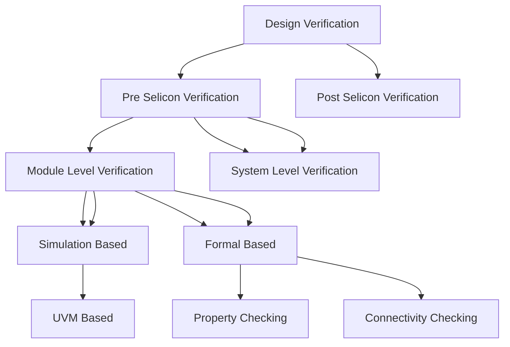

## 2026-04-01

## What is Design Verification

**Module level verification:** Η διαδικασία κατά την οποία εξετάζουμε την ορθότητα των επί μέρους modules ενός DUT.

Αφού γίνει αυτή η διαδικασία (για τα περισσότερα ή όλα τα modules) μετά περνάμε στην **System Level Verification**




## Βασικά Components


### DUT - Device/Design Under Test

**DUT** είναι η συσκευή (chip ή module) που θέλουμε να ελέγξουμε

### Model

**Model** είναι μία συνάρτηση που προσωμοιώνει την λειτουργία του **DUT** μέσω κώδικα. 

### Scoreboard

**Scoreboard** συγκρίνει τα δεδομένα ανάμεσα στο **model** και στο **DUT**.
    Στόχος μας είναι να βρούμε κατάλληλες εισόδους έτσι ώστε να έχουμε διαφορά ανάμεσα σε **DUT** και **Model**. 

# Device Under Test - Ανάλυση Χαρακτηριστικών

Το DUT που θα μελετηθεί είναι **Aligner**


## Interface - Διεπαφή

### Παράμετροι

Ο **Aligner** έχει δύο βασικές **παραμέτρους**:

- **ALIGN_DATA_WIDTH** -> Το μήκος του ***data bus*** με το οποίο λαμβάνονται τα ***unaligned data - md_rx_data*** και στέλνονται τα ***aligneed data - md_tx_data***. (deault = 32)

- **FIFO_DEPTH** -> Το βάθος των δίδο ***FIFO*** για την διαχείριση των δεδομένων (default = 8)

### Διεπαφή

Χρησιμοποιούνται δύο τύποι διεπαφών:

- **AMBA 3 APB** για τους καταχωρητές
- **2 Interfaces** με κοινή MD (Memory Data):
    - **RX** διεπαφή για να λαμβάνει δεδομένα
    - **ΤΧ** διεπαφή για να στέλνει δεδομένα   


## Registers - Καταχωρητές

Το **module** έχει 4 καταχωρητές:

|       | Offset | Name                               |
|:-----:|:------:|------------------------------------|
| CTRL  | 0x0000 | Control Register                   |
| STATUS| 0x000C | Status Register                    |
| IRQEN | 0x00F0 | Interrupt Requests Enable Register |
| IRQ   | 0x00F4 | Interrupt Request Register         |


- **CTRL**: Έχει τρεις βασικές λειτουργίες:
    
    - Να ελέγχει το μέγεθος των ***aligned data***. Αν πάρει 0 βγάζει APB Error
    - Να ελέγχει το offset των ***aligned data***.
        - Αν το ζεύγος (Size, Offset) είναι λάθος επιστρέφει APB Error
    - Να σβήνει τον ***Status counter*** (COUNT_DROP) 

- **STATUS**: Περιέχει πληροφορίες για την τωρινή κατάσταση του module:
    - Αριθμός των ***unaligned*** προσβάσεων
        - Πρέπει να γίνουν dropped, Όταν φτάσουν στην μέγιστη τιμή δεν κάνει wrap ο counter
    - Το επίπεδο πλήρωσης (fill level) της RX FIFO
    - Το επίπεδο πλήρωσης της TX FIFO
        - Τα επίπεδα αφορούν το μέγεθος των transactions και όχι των byte. Με άλλα λόγια εάν μία είσοδος αποτελείται είτε από 1, 2, 4 byte ο counter θα αυξηθεί κατά 1.

- **IRQEN**: Περιέχει bits που επιτρέπουν κάθε ξεχωριστό interrupt
    - RX_FIFO_EMPTY
    - RX_FIFO_FULL
    - TX_FIFO_EMPTY
    - TX_FIFO_FULL
    - MAX_DROP

- **IRQ**: Περέχει την κατάσταση κάθε available interrupt
    - RX_FIFO_EMPTY
    - RX_FIFO_FULL
    - TX_FIFO_EMPTY
    - TX_FIFO_FULL
        - Αυτά είναι sticky. Εάν γίνουν clear δεν θα γίνουν set μέχρι η FIFO να φτάσει σε αυτή την κατάσταση πάλι
    - MAX_DROP 
        - STATUS.CNT_DROP φτάνει την μέγιστη τιμή (sticky).  

## Functionality - Λειτουργικότητα

Στην εικόνα παρακάτω βλέπουμε για ALIGN_DATA_WIDTH = 32 το πώς λειτουργεί το κύκλωμα για διαφορετικά ζεύγη (SIZE, OFFSET).


### RX Controller

1ον μπορεί να ανακόψει την εισροή δεδομένων όταν η RX_FIFO είναι γεμάτη μέσω του ***md_rx_ready = 0***.

2ον καθορίζει εάν μία εισερχόμενη MD transfer είναι νόμιμη:

- $ (\frac{ALIGN\_DATA\_WIDTH}{8} + offset) \% size  =0$ 

Σε αυτή την περίπτωση επιστρέφει  (***md_rx_err = 1***) και ο drop counter αυξάνεται κατά 1, εάν δεν έχει φτάσει στην μέγιστη τιμή. Εάν είναι στην μέγιστη τιμή δεν αυξάνεται περαιτέρω και θα ξαναμηδενίσει όταν ***CTRL.CLR = 1***.
- Πάντα όταν φτάνει στην μέγιστη τιμή ο counter παράγεται ένα interrupt. Όταν συμβεί αυτό το ***IRQ.MAX_DROP = 1*** θα μείνει μέχρι να γίνει cleared.

### RX FIFO

Αποθηκεύει δεδομένα μέχρι ο Controller να μπορεί να τα απορροφήσει. Το fill level υπάρχει στο ***STATUS.RX_LVL***.

### Controller 

Όποτε η **RX_FIFO** έχει δεδομένα τα απορροφά κάνει το allignment και τα περνά στην **TX_FIFO**. Εάν η **TX_FIFO** είναι γεμάτη περιμένει να αδειάσει για να συνεχίσει.

### TX FIFO 

Λειτουργεί ακριβώς αντίστοιχα με την RX_FIFO

### TX Controller 

Παίρνει δεδομένα από την **TX_FIFO** και τα στέλνει στο **md_tx interface**.

## Σχόλια

- Δεν έχει σημασία η αρχική θέση των **words**. Δηλαδή το γεγονός ότι ένα byte ήρθε στην θέση 2 για παράδειγμα, δεν σημαίνει ότι θα κατευθυνθεί στην θέση 2.

- Επιπλέον byte που δεν στάλθηκαν ξαναξεκινάνε από την θέση που ορίζει το **offset**.


# Environment Architecture


## Agent

**Agent** είναι έαν **uvm component** υπεύθυνο για τον έλεγχο ενός interface. Άρα από την μελέτη του **DUT** είναι προφανές ότι χρειαζόμαστε 3 **agents**.

### Βασική δομή ενός agent

Αποτελείται από:
- **Interface**

| Component | Ρόλος |
|:----------|:------|
| **Sequencer** | Ελέγχει την σειρά εκτέλεσης των βημάτων από ένα high-level αίτημα |
| **Driver** | Παίρνει τα abstract transactions του sequencer και τα μεταφράζει σε pin-level σήματα στο interface |
| **Monitor** | Παρακολουθεί παθητικά τα σήματα του interface και τα μετατρέπει πάλι σε abstract transactions για ανάλυση |
| **Coverage** | Συλλέγει μετρικές για το πόσο καλά έχουμε ελέγξει το DUT — καταγράφει ποιες καταστάσεις/συνδυασμοί έχουν εκτελεστεί |
| **Config** | Αποθηκεύει τις παραμέτρους ρύθμισης του agent (π.χ. active/passive mode, interface handle) και τις μοιράζει στα υπόλοιπα components |


## Testbench

Αρχικά στο **Testbench** εμπεριέχεται το **DUT**. Για να μπορεί να λειτουργήσει το **DUT**, χρειάζεται ακόμα:

- Clock Generator
- Initial Reset Generator
- UVM start logic: Συνήθως είναι απλά μία κλήση στην `run_test()`. Όταν καλείτε γίνονται τα εξής:
    - Αρχικοποιείται το UVM test
    - Ξεκινάνε τα **UVM phases**

### Αρχικοποίηση Test

Για να τρέξουμε το testbench με ένα test υπάρχουν 2 μέθοδοι:

<table style="width:100%; table-layout:fixed;">
<tr>
<th style="width:50%">Κώδικας Α</th>
<th style="width:50%">Κώδικας Β</th>
</tr>
<tr>
<td style="width:50%; vertical-align:top;">
<pre><code class="language-systemverilog">
module testbench();
  import uvm_pkg::*;

    initial begin
        run_test("cls_algn_test_reg_access");
    end
endmodule
</code></pre>
</td>
<td style="width:50%; vertical-align:top;">
<pre><code class="language-systemverilog">
module testbench();
  import uvm_pkg::*;

    initial begin
        run_test("");
    end
endmodule
</code></pre>
</td>
</tr>
</table>

Στον κώδικα Β προσθέτουμε  `+UVM_TESTNAME=cls_algn_test_reg_access` για να τρέξει σωστά στον simulator.
Γενικά ο **Κώδικας Β** είναι ο προτιμότετος

### UVM Naming Conventions

- Ένα σχόλιο είναι ότι στην βιομηχανία είναι τυπικό ένα όνομα **testbench** να έχει την δομή, όπως `cls_algn_test_reg_access`:
    - Συντομογραφία ονόματος εταιρείας (`cls`)
    - Συντομογραφία ονόματος DUT (`algn`)
    - Το όνομα του test μετά

Προφανώς όλα τα tests πρέπει να κληρωνομούν από την `uvm_test` κλάση.

### Run UVM Phases

Κάθε **uvm test** έχει 9 **phases**:

| Phase | Συνάρτηση |
|-------|-----------|
| Build | `build_phase()` |
| Connect | `connect_phase()` |
| End of Elaboration | `end_of_elaboration_phase()` |
| Start of Simulation | `start_of_simulation_phase()` |
| Run | `run_phase()` |
| Extract | `extract_phase()` |
| Check | `check_phase()` |
| Report | `report_phase()` |
| Final | `final_phase()` |

Ουσιατικά με τον όρο **phases**, εννοούμε ορισμένες συναρτήσεις οι οποίες καλούνται με αυτή την συγκεκριμένη σειρά.

* Μόνο η `run_phase()` είναι **task** γιατί πρέπει να καταναλώνει χρόνο.
* Όλες αυτές οι κλάσεις κληρονομούν την `uvm_component`. Ομοίως όλες οι κλάσεις όπως το `uvm_test` και σχεδόν τα πάντα κληρονομούν από το `uvm_component`.

*  Όλα τα **components** υλοποιούνται στην `build_phase()`. Γενικά από όλα τα phases κυρίως χρησιμοποιούνται 3.
    * `build_phase()`
    * `connect_pahse()`
    * `run_phase()`

## Test

Κατά το **verification**, θα χρησιμοποιήσουμε πολλά διαφορετικά tests. Όλα αυτά θα κληρονομούν την `uvm_test` κλάση.

Επειδή όμως γενικά θέλουμε αυτά τα tests να έχουν και άλλα κοινά όπως το **Environment**, ορίζουμε και μία ενδιάμεση κλάση πχ
- `uvm_algn_test_base`


## 2026-04-02

# UVM implementation

Το project θα υλοποιηθεί με τη εκδοχή **UVM 1.2** με τα παρακάτω χρήσιμα links:

- [User Manual](https://www.accellera.org/images//downloads/standards/uvm/uvm_users_guide_1.2.pdf)

- [Class Reference](https://www.accellera.org/images/downloads/standards/uvm/UVM_Class_Reference_Manual_1.2.pdf)

Οι προσωμοιώσεις για αρχή θα γίνουν με το **EDA Playground**, με το εργαλείο **Cadence Xcelium 25.03**

## Testbench

Τρέχοντας τον παρακάτω κώδικα από μόνο του θα παρχθεί ένα `UVM_FATAL`, καθώς δεν έχουμε ορίσει ποια συνάρτηση θα καλέι με την `run_test()`. Για να δουλέψει σωστά χρειάζεται το κατάλληλο όρισμα στο **Run Options**, όπου για τώρα θα γράψουμε `UVM_TESTNAME=cfs_algn_test_reg_access`.

```sv
module testbench();
  
  import uvm_pkg::*;
  
  // --------------------- Clock Logic ---------------------
  reg clk;
  initial begin
    clk = 0;
   
    forever begin
      clk = #5ns ~clk; // f = 100Mhz
    end
    
  end
  
  // --------------------- Reset Logic ---------------------
  
  reg reset_n;
  initial begin
    
    reset_n = 1;
    
    #6ns; reset_n = 0;
    
    #30ns; reset_n = 1;
    
  end
  
  // --------------------- Call to test ---------------------
  
  initial begin
    run_test("");
  end
    
  
  // --------------------- DUT instance ---------------------
  cfs_aligner dut(
    .clk(clk),
    .reset_n(reset_n)
  );
  
endmodule

```

