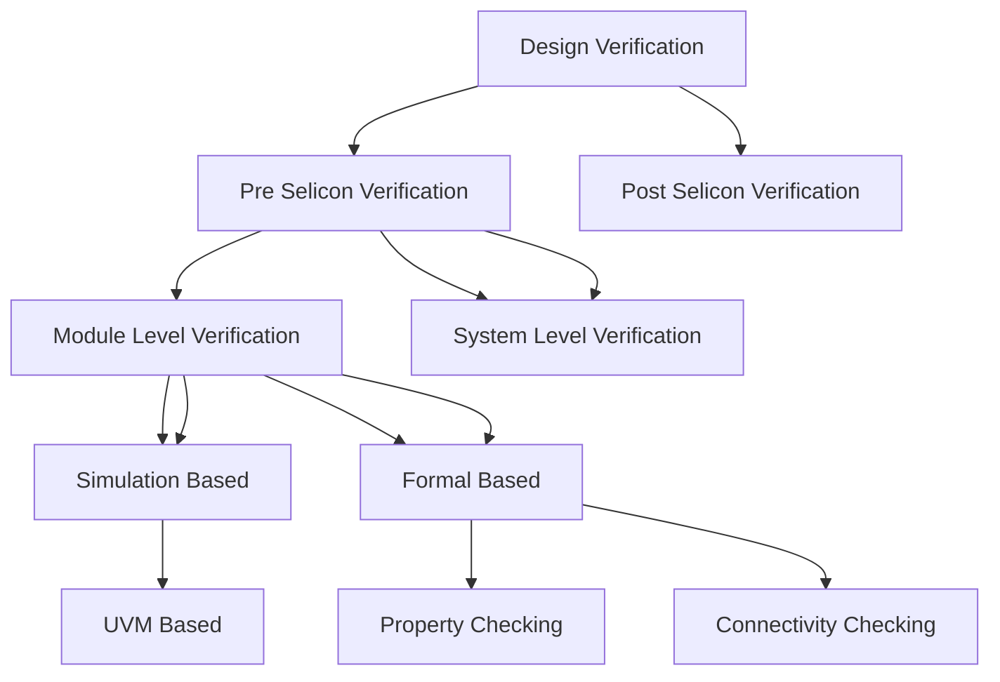
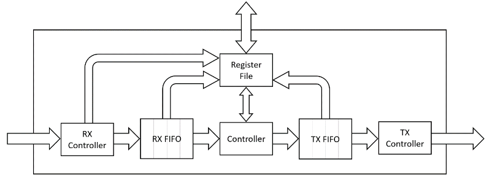
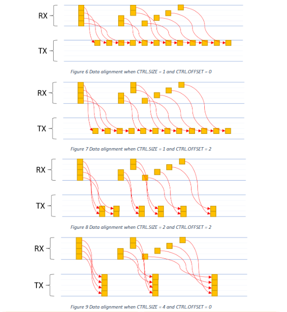
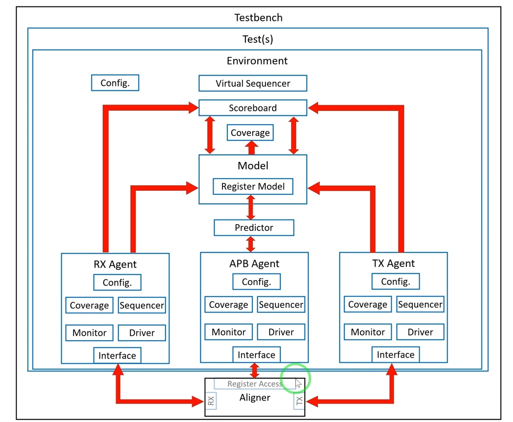
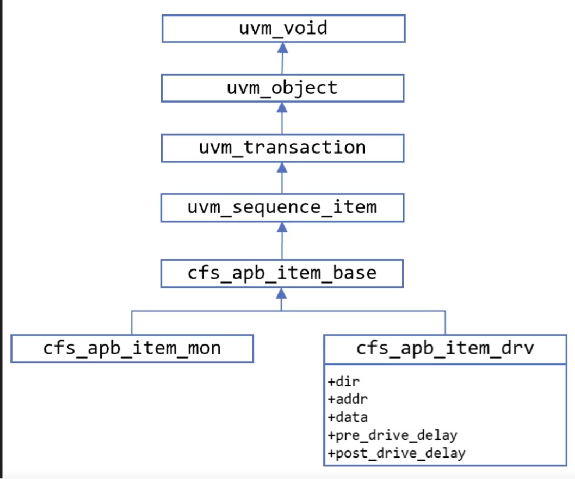
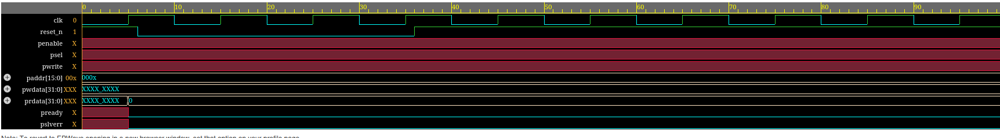
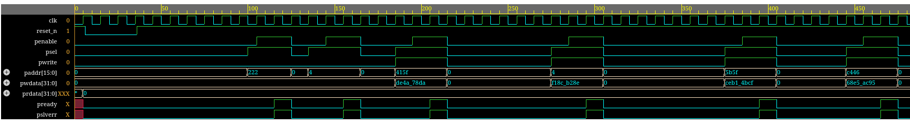
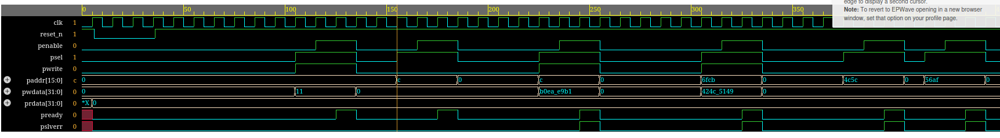
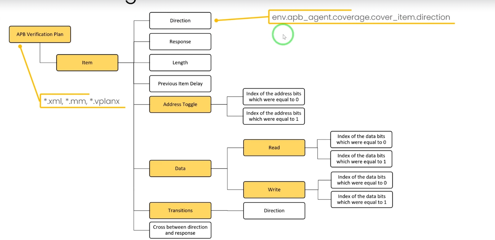
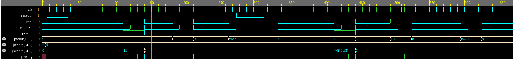

## 2026-04-01

## What is Design Verification

**Module level verification:** Η διαδικασία κατά την οποία εξετάζουμε την ορθότητα των επί μέρους modules ενός DUT.

Αφού γίνει αυτή η διαδικασία (για τα περισσότερα ή όλα τα modules) μετά περνάμε στην **System Level Verification**




## Βασικά Components


### DUT - Device/Design Under Test

**DUT** είναι η συσκευή (chip ή module) που θέλουμε να ελέγξουμε

### Model

**Model** είναι μία συνάρτηση που προσωμοιώνει την λειτουργία του **DUT** μέσω κώδικα. 

### Scoreboard

**Scoreboard** συγκρίνει τα δεδομένα ανάμεσα στο **model** και στο **DUT**.
    Στόχος μας είναι να βρούμε κατάλληλες εισόδους έτσι ώστε να έχουμε διαφορά ανάμεσα σε **DUT** και **Model**. 

# Device Under Test - Ανάλυση Χαρακτηριστικών

Το DUT που θα μελετηθεί είναι **Aligner**



## Interface - Διεπαφή

### Παράμετροι

Ο **Aligner** έχει δύο βασικές **παραμέτρους**:

- **ALIGN_DATA_WIDTH** -> Το μήκος του ***data bus*** με το οποίο λαμβάνονται τα ***unaligned data - md_rx_data*** και στέλνονται τα ***aligneed data - md_tx_data***. (deault = 32)

- **FIFO_DEPTH** -> Το βάθος των δίδο ***FIFO*** για την διαχείριση των δεδομένων (default = 8)

### Διεπαφή

Χρησιμοποιούνται δύο τύποι διεπαφών:

- **AMBA 3 APB** για τους καταχωρητές
- **2 Interfaces** με κοινή MD (Memory Data):
    - **RX** διεπαφή για να λαμβάνει δεδομένα
    - **ΤΧ** διεπαφή για να στέλνει δεδομένα   


## Registers - Καταχωρητές

Το **module** έχει 4 καταχωρητές:

|       | Offset | Name                               |
|:-----:|:------:|------------------------------------|
| CTRL  | 0x0000 | Control Register                   |
| STATUS| 0x000C | Status Register                    |
| IRQEN | 0x00F0 | Interrupt Requests Enable Register |
| IRQ   | 0x00F4 | Interrupt Request Register         |


- **CTRL**: Έχει τρεις βασικές λειτουργίες:
    
    - Να ελέγχει το μέγεθος των ***aligned data***. Αν πάρει 0 βγάζει APB Error
    - Να ελέγχει το offset των ***aligned data***.
        - Αν το ζεύγος (Size, Offset) είναι λάθος επιστρέφει APB Error
    - Να σβήνει τον ***Status counter*** (COUNT_DROP) 

- **STATUS**: Περιέχει πληροφορίες για την τωρινή κατάσταση του module:
    - Αριθμός των ***unaligned*** προσβάσεων
        - Πρέπει να γίνουν dropped, Όταν φτάσουν στην μέγιστη τιμή δεν κάνει wrap ο counter
    - Το επίπεδο πλήρωσης (fill level) της RX FIFO
    - Το επίπεδο πλήρωσης της TX FIFO
        - Τα επίπεδα αφορούν το μέγεθος των transactions και όχι των byte. Με άλλα λόγια εάν μία είσοδος αποτελείται είτε από 1, 2, 4 byte ο counter θα αυξηθεί κατά 1.

- **IRQEN**: Περιέχει bits που επιτρέπουν κάθε ξεχωριστό interrupt
    - RX_FIFO_EMPTY
    - RX_FIFO_FULL
    - TX_FIFO_EMPTY
    - TX_FIFO_FULL
    - MAX_DROP

- **IRQ**: Περέχει την κατάσταση κάθε available interrupt
    - RX_FIFO_EMPTY
    - RX_FIFO_FULL
    - TX_FIFO_EMPTY
    - TX_FIFO_FULL
        - Αυτά είναι sticky. Εάν γίνουν clear δεν θα γίνουν set μέχρι η FIFO να φτάσει σε αυτή την κατάσταση πάλι
    - MAX_DROP 
        - STATUS.CNT_DROP φτάνει την μέγιστη τιμή (sticky).  

## Functionality - Λειτουργικότητα

Στην εικόνα παρακάτω βλέπουμε για ALIGN_DATA_WIDTH = 32 το πώς λειτουργεί το κύκλωμα για διαφορετικά ζεύγη (SIZE, OFFSET).



### RX Controller

1ον μπορεί να ανακόψει την εισροή δεδομένων όταν η RX_FIFO είναι γεμάτη μέσω του ***md_rx_ready = 0***.

2ον καθορίζει εάν μία εισερχόμενη MD transfer είναι νόμιμη:

- $ (\frac{ALIGN\_DATA\_WIDTH}{8} + offset) \% size  =0$ 

Σε αυτή την περίπτωση επιστρέφει  (***md_rx_err = 1***) και ο drop counter αυξάνεται κατά 1, εάν δεν έχει φτάσει στην μέγιστη τιμή. Εάν είναι στην μέγιστη τιμή δεν αυξάνεται περαιτέρω και θα ξαναμηδενίσει όταν ***CTRL.CLR = 1***.
- Πάντα όταν φτάνει στην μέγιστη τιμή ο counter παράγεται ένα interrupt. Όταν συμβεί αυτό το ***IRQ.MAX_DROP = 1*** θα μείνει μέχρι να γίνει cleared.

### RX FIFO

Αποθηκεύει δεδομένα μέχρι ο Controller να μπορεί να τα απορροφήσει. Το fill level υπάρχει στο ***STATUS.RX_LVL***.

### Controller 

Όποτε η **RX_FIFO** έχει δεδομένα τα απορροφά κάνει το allignment και τα περνά στην **TX_FIFO**. Εάν η **TX_FIFO** είναι γεμάτη περιμένει να αδειάσει για να συνεχίσει.

### TX FIFO 

Λειτουργεί ακριβώς αντίστοιχα με την RX_FIFO

### TX Controller 

Παίρνει δεδομένα από την **TX_FIFO** και τα στέλνει στο **md_tx interface**.

## Σχόλια

- Δεν έχει σημασία η αρχική θέση των **words**. Δηλαδή το γεγονός ότι ένα byte ήρθε στην θέση 2 για παράδειγμα, δεν σημαίνει ότι θα κατευθυνθεί στην θέση 2.

- Επιπλέον byte που δεν στάλθηκαν ξαναξεκινάνε από την θέση που ορίζει το **offset**.


# Environment Architecture



## Agent

**Agent** είναι έαν **uvm component** υπεύθυνο για τον έλεγχο ενός interface. Άρα από την μελέτη του **DUT** είναι προφανές ότι χρειαζόμαστε 3 **agents**.

### Βασική δομή ενός agent

Αποτελείται από:
- **Interface**

| Component | Ρόλος |
|:----------|:------|
| **Sequencer** | Ελέγχει την σειρά εκτέλεσης των βημάτων από ένα high-level αίτημα |
| **Driver** | Παίρνει τα abstract transactions του sequencer και τα μεταφράζει σε pin-level σήματα στο interface |
| **Monitor** | Παρακολουθεί παθητικά τα σήματα του interface και τα μετατρέπει πάλι σε abstract transactions για ανάλυση |
| **Coverage** | Συλλέγει μετρικές για το πόσο καλά έχουμε ελέγξει το DUT — καταγράφει ποιες καταστάσεις/συνδυασμοί έχουν εκτελεστεί |
| **Config** | Αποθηκεύει τις παραμέτρους ρύθμισης του agent (π.χ. active/passive mode, interface handle) και τις μοιράζει στα υπόλοιπα components |


## Testbench

Αρχικά στο **Testbench** εμπεριέχεται το **DUT**. Για να μπορεί να λειτουργήσει το **DUT**, χρειάζεται ακόμα:

- Clock Generator
- Initial Reset Generator
- UVM start logic: Συνήθως είναι απλά μία κλήση στην `run_test()`. Όταν καλείτε γίνονται τα εξής:
    - Αρχικοποιείται το UVM test
    - Ξεκινάνε τα **UVM phases**

### Αρχικοποίηση Test

Για να τρέξουμε το testbench με ένα test υπάρχουν 2 μέθοδοι:

<table style="width:100%; table-layout:fixed;">
<tr>
<th style="width:50%">Κώδικας Α</th>
<th style="width:50%">Κώδικας Β</th>
</tr>
<tr>
<td style="width:50%; vertical-align:top;">
<pre><code class="language-systemverilog">
module testbench();
  import uvm_pkg::*;

    initial begin
        run_test("cls_algn_test_reg_access");
    end
endmodule
</code></pre>
</td>
<td style="width:50%; vertical-align:top;">
<pre><code class="language-systemverilog">
module testbench();
  import uvm_pkg::*;

    initial begin
        run_test("");
    end
endmodule
</code></pre>
</td>
</tr>
</table>

Στον κώδικα Β προσθέτουμε  `+UVM_TESTNAME=cls_algn_test_reg_access` για να τρέξει σωστά στον simulator.
Γενικά ο **Κώδικας Β** είναι ο προτιμότετος
- @t 2026-04-03 Θέλει μεγάλη προσοχή να μην υπάρχει κενό ανάμεσα στ + και το UVM_TESTNAME.

### UVM Naming Conventions

- Ένα σχόλιο είναι ότι στην βιομηχανία είναι τυπικό ένα όνομα **testbench** να έχει την δομή, όπως `cls_algn_test_reg_access`:
    - Συντομογραφία ονόματος εταιρείας (`cls`)
    - Συντομογραφία ονόματος DUT (`algn`)
    - Το όνομα του test μετά

Προφανώς όλα τα tests πρέπει να κληρωνομούν από την `uvm_test` κλάση.

### Run UVM Phases

Κάθε **uvm test** έχει 9 **phases**:

| Phase | Συνάρτηση |
|-------|-----------|
| Build | `build_phase()` |
| Connect | `connect_phase()` |
| End of Elaboration | `end_of_elaboration_phase()` |
| Start of Simulation | `start_of_simulation_phase()` |
| Run | `run_phase()` |
| Extract | `extract_phase()` |
| Check | `check_phase()` |
| Report | `report_phase()` |
| Final | `final_phase()` |

Ουσιατικά με τον όρο **phases**, εννοούμε ορισμένες συναρτήσεις οι οποίες καλούνται με αυτή την συγκεκριμένη σειρά.

* Μόνο η `run_phase()` είναι **task** γιατί πρέπει να καταναλώνει χρόνο.
* Όλες αυτές οι κλάσεις κληρονομούν την `uvm_component`. Ομοίως όλες οι κλάσεις όπως το `uvm_test` και σχεδόν τα πάντα κληρονομούν από το `uvm_component`.

*  Όλα τα **components** υλοποιούνται στην `build_phase()`. Γενικά από όλα τα phases κυρίως χρησιμοποιούνται 3.
    * `build_phase()`
    * `connect_pahse()`
    * `run_phase()`

## Test

Κατά το **verification**, θα χρησιμοποιήσουμε πολλά διαφορετικά tests. Όλα αυτά θα κληρονομούν την `uvm_test` κλάση.

Επειδή όμως γενικά θέλουμε αυτά τα tests να έχουν και άλλα κοινά όπως το **Environment**, ορίζουμε και μία ενδιάμεση κλάση πχ
- `uvm_algn_test_base`


## 2026-04-02

# UVM implementation

Το project θα υλοποιηθεί με τη εκδοχή **UVM 1.2** με τα παρακάτω χρήσιμα links:

- [User Manual](https://www.accellera.org/images//downloads/standards/uvm/uvm_users_guide_1.2.pdf)

- [Class Reference](https://www.accellera.org/images/downloads/standards/uvm/UVM_Class_Reference_Manual_1.2.pdf)

Οι προσωμοιώσεις για αρχή θα γίνουν με το **EDA Playground**, με το εργαλείο **Cadence Xcelium 25.03**

## Testbench

Τρέχοντας τον παρακάτω κώδικα από μόνο του θα παρχθεί ένα `UVM_FATAL`, καθώς δεν έχουμε ορίσει ποια συνάρτηση θα καλέι με την `run_test()`. Για να δουλέψει σωστά χρειάζεται το κατάλληλο όρισμα στο **Run Options**, όπου για τώρα θα γράψουμε `UVM_TESTNAME=cfs_algn_test_reg_access`.

- @t 2026-04-03 Ιδιαίτερη προσοχή θέλουν οι εντολές που επιτρέπουν το να περνάμε τις τιμές των μεταβλητών σε αρχεία:
    - `$dumpfile(<όνομα αρχείου>);`
    - `$dumpvars;`
        - Για να δούμε τα αρχεία θα πρέπει να ενεργοποιήσουμε και το **Open EPWave after run**.

```sv
module testbench();
  
  import uvm_pkg::*;
  
  // --------------------- Clock Logic ---------------------
  reg clk;
  initial begin
    clk = 0;
   
    forever begin
      clk = #5ns ~clk; // f = 100Mhz
    end
    
  end
  
  // --------------------- Reset Logic ---------------------
  
  reg reset_n;
  initial begin
    
    reset_n = 1;
    
    #6ns; reset_n = 0;
    
    #30ns; reset_n = 1;
    
  end
  
  // --------------------- Call to test ---------------------
  
  initial begin

    $dumpfile("dump.vcd");
    $dumpvars;

    run_test("");
  end
    
  
  // --------------------- DUT instance ---------------------
  cfs_aligner dut(
    .clk(clk),
    .reset_n(reset_n)
  );
  
endmodule

```

## 2026-04-03

## [Σχεδίαση Test Package](code/test/cfs_algn_test_pkg.sv)

Γενικά μία συχνή πρακτική όταν σχεδίαζουμε ένα **package** που περιέχει κλάσεις είναι συνήθεις πρακτική αυτό το αρχείο απλά να δείχνει σε αρχεία για κάθε κλάση ξεχωριστά.

```sv
`ifndef CFS_ALGN_TEST_PKG_SV
    
    `define CFS_ALGN_TEST_PKG_SV

    package cfs_algn_test_pkg;

        `include "cfs_algn_test_base.sv"
        `include "cfs_algn_test_reg_access.sv"

    endpackage

`endif
```

Το **package** πέρα από τις κλάσεις tests περιέχει και δείκτες προς την κλάση **environment**.

## [Base Test Class](code/test/cfs_algn_test_base.sv) 

Όπως σε κάθε **uvm component**, κατά τον ορσιμό του πρέπει να προσθέσουμε:

- `` `uvm_component_utils(<Όνομα κλάσης>);``
    -  Για να έχουμε όμως πρόσβαση στο αρχείο πρέπει να κάνουμε από το [**package**](code/test/cfs_algn_test_pkg.sv), το "uvm_macros.svh".
    - Ένα συχνό λάθος είναι να βάζεις `;` στο τέλος κάτι το οποίο δεν γίνεται στα **macros**.
 
- ```function new(string name = "", uvm_component parent);```

 Αυτά τα δύο είναι υποχρεωτικό να υπάρχουν σε όλες τις κλάσεις που είναι **components**.

Ακόμα αυτή η κλάση χρειάζεται να χειρίζεται και το **environment**.  Άρα:

- `cfs_algn_env env`: Ορίζουμε ένα νέο environment.

- `build phase` 

    - ```sv 
        virtual function void build_phase(uvm_phase phase);
            super.build_phase(phase);

            env = cfs_algn_env::type_id::create(
                "env", // Συνήθης πρακτική να ταυτίζεται με το όνομα του instance 
                this // Το γονικό του είναι προφανώς η ίδια η κλάση
            );
        endfunction
    1. Αρχικά ορίζουμε ότι η συνάρτηση καλεί την `build_phase` του γονικού
    2. Μετά ορίζουμε την `env` μέσω της τυπικής μεθόδου στο **uvm**, με την συνάρτηση `type_id::create()` που υπάρχει σε κάθε κλάση **component**. 

### [Reg Access Test](code/test/cfs_algn_reg_access.sv)

Ουσιαστικά απλά κληρονομεί την **base** κλάση προς το παρόν καθώς δεν έχουμε προσθέσει λειτουργικότητα.

 ## [Environment](code/test/cfS_algn_env.sv)

Όπως και τα υπόλοιπα **components**. Προς το παρόν κυρίως αφορά **boilerplate** κώδικα.


## Run task

Αφού τελειώσαμε με το βασικό κομμάτι (**build_phase**), πάμε να υλοποιήσουμε έναν αρχικό κώδικα που θα τρέχει το **test** μας. Αυτό προφανώς γίνεται στο αρχείο [test reg access](code/test/cfs_algn_reg_access.sv).

```sv
    virtual task run_phase(uvm_phase phase);
    
        phase.raise_objection(this, "TEST_DONE");

        `uvm_info("DEBUG", "start of test", UVM_LOW)

        #100ns;

        `uvm_info("DEBUG", "end of test", UVM_LOW)

        phase.drop_objection(this, "TEST_DONE");

    endtask
```

### UVM Info

Η εντολή `` `uvm_info`` είναι ο συνήθης τρόπος με τον οποίο στέλνουμε μηνύματα στην έξοδο με το **uvm**. Έχει τρία ορίσματα:

1. `"DEBUG"` -> Είναι ένα id του μηνύματος.
2. `"<μήνυμα">` -> Είναι το μήνυμα που εμφανίζεται στην οθόνη
3. `<Verbosity Level>` -> Επηρεάζει εάν το μήνυμα θα φανεί ή όχι (πιο πολλά παρακάτω) 


### Objection mechanism

Είναι ο τρόπος με τον οποίο στο **uvm** ολοκληρώνεται ένα **test**. Μπορείς να το φανταστείς σαν έναν counter που:

- `raise objection` -> Αυξάνει τον counter
- `drop objection` --> Μειώνει τον counter 

Η προσωμοίωση τελειώνει όταν η τιμή του **counter** γίνει 0.

---

# Τωρινή Κατάσταση

## [testbench.sv](code/test/testbench.sv)

```sv
`include "cfs_algn_test_pkg.sv"

module testbench();
  
  import uvm_pkg::*;
  import cfs_algn_test_pkg::*;
  
  // --------------------- Clock Logic ---------------------
  reg clk;
  
  initial begin
    clk = 0;
   
    forever begin
      clk = #5ns ~clk; // f = 100Mhz
    end
    
  end
  
  // --------------------- Reset Logic ---------------------
  
  reg reset_n;
  
  initial begin
    
    reset_n = 1;
    
    #6ns;  reset_n = 0;
    
    #30ns; reset_n = 1;
    
  end
  
  // --------------------- Call to test ---------------------
  
  initial begin
    
    $dumpfile("dump.vcd");
    $dumpvars;
    
    run_test("");
  end
    
  
  // --------------------- DUT instance ---------------------
  cfs_aligner dut(
    .clk     (clk	),
    .reset_n (reset_n)
  );
  
endmodule
```

## [cfs_algn_test_pkg.sv](code/test/cfs_algn_test_pkg.sv)

```sv
`ifndef CFS_ALGN_TEST_PKG_SV
    
    `define CFS_ALGN_TEST_PKG_SV

    `include "uvm_macros.svh"
    `include "cfs_algn_pkg.sv"

    package cfs_algn_test_pkg;

        import uvm_pkg::*;
        import cfs_algn_pkg::*;

        `include "cfs_algn_test_base.sv"
        `include "cfs_algn_test_reg_access.sv"

    endpackage

`endif
```

## [cfs_algn_pkg.sv](code/test/cfs_algn_pkg.sv)

```sv
`ifndef CFS_ALGN_PKG_SV

    `define CFS_ALGN_PKG_SV

    `include "uvm_macros.svh"

    package cfs_algn_pkg;

        import uvm_pkg::*;

        `include "cfs_algn_env.sv"


    endpackage

`endif
```

## [cfs_algn_env.sv](code/test/cfs_algn_env.sv)

```sv
`ifndef CFS_ALGN_ENV_SV

    `define CFS_ALGN_ENV_SV

    class cfs_algn_env extends uvm_env;

       `uvm_component_utils(cfs_algn_env)

       function new(string name = "", uvm_component parent);
            super.new(name, parent);
       endfunction 

    endclass

`endif
```

## [cfs_algn_test_base.sv](code/test/cfs_algn_test_base.sv)

```sv
`ifndef CFS_ALGN_TEST_BASE_SV

    `define CFS_ALGN_TEST_BASE_SV

    `include "uvm_macros.svh"

    class cfs_algn_test_base extends uvm_test;

        cfs_algn_env env;

        `uvm_component_utils(cfs_algn_test_base)

        function new(string name, uvm_component parent);
            super.new(name, parent);
        endfunction

        virtual function void build_phase(uvm_phase phase);
            super.build_phase(phase);

            env = cfs_algn_env::type_id::create("env", this);
        endfunction

    endclass

`endif
```

## [cfs_algn_test_reg_access.sv](code/test/cfs_algn_test_reg_access.sv)

```sv
`ifndef CFS_ALGN_TEST_REG_ACCESS_SV

    `define CFS_ALGN_TEST_REG_ACCESS_SV

    `include "uvm_macros.svh"

    class cfs_algn_test_reg_access extends cfs_algn_test_base;

        `uvm_component_utils(cfs_algn_test_reg_access)

        function new(string name, uvm_component parent);
            super.new(name, parent);
        endfunction

        virtual task run_phase(uvm_phase phase);
    
            phase.raise_objection(this, "TEST_DONE");

            `uvm_info("DEBUG", "start of test", UVM_LOW)

            #100ns;

            `uvm_info("DEBUG", "end of test", UVM_LOW)

            phase.drop_objection(this, "TEST_DONE");

        endtask

    endclass

`endif
```

## Σχεδιάγραμμα Υπάρχοντος Κώδικα


## 2026-04-19

# Κεφάλαιο 2

# APB Agent Infrastructure

## Στόχος η σχεδίαση του APB Agent

### UVM Configuration Database

- Στην ουσία είναι ένα instance μίας κλάσης `uvm_config_db#(T)` όπου `Τ` ο τύπος των δεδομένων που θέλουμε να περάσουμε στην βάση.
 
    - `set`: Προσθέτουμε το component. 

    - `get`:  Παίρνουμε το component.

        - Στην ουσία τους **pointers** αποθηκεύουμε στην κλάση.


### Set function - `uvm_config_db#(T)::set()`

```sv
static function void set{
    uvm component cntxt,
    string inst_name,
    string field_name,
    T value
}
```

- `T`: H πραγματική τιμή που περνάμε 

- `field_name`:  Το όνομα της τιμής την οποία παιρνάμε στην βάση.

Για παράδειγμα

```sv
uvm_config_db#(int)::set(
    null, 
    "uvm_test_top.env.apb_agent", // Ολόκληρο το όνομα
    "bus_width",
    32
)
```

Έχει σημασία από που καλούμαι την συνάρτηση. Εάν την καλέσομε από το Testbench επειδή δεν είναι **component** αλλά **module** βάζουμε null.

Αντίστοιχα εάν καλέσουμε την συνάρτηση από το **Test** το οποίο είναι **component**, μπορούμε να γράψουμε:

```sv
uvm_config_db#(int)::set(
    this, 
    "env.apb_agent", 
    "bus_width", 
    32)
```

Η συνάρτηση `set` επίσης υποστηρίζει `*` notation. Για παράδειγμα στον παρακάτω κώδικα αναφέρουμε ότι θέλουμε όλα τα **comonents** μετά το `uvm_test_top` να έχουν πρόσβαση στο **bus**.

```sv
uvm_config_db#(int)::set(
    null,
    "uvm_test_top.*",
    "bus_width",
    32
)
```

**SOS**: Θέλει μεγάλη προσοχή όταν καλούμε την `set` από διαφορετικά μέρη στην ιεραρχία. Αυτό συμβαίνει γιατί ανάλογα με το που θα καλέσουμε τη `get`. 

- Όταν γίνεται το `build_phase` η `get` θα πάρει το **component**, με το υψηλότερο **context** στην ιεραρχία.

- Όταν γίνεται το `run_phase` η `get` θα πάρει την τελευταία τιμή που έχει μπει στην βάση.

### Get function - `uvm_config_db#(T)::get()`

```sv
static function bit get(
    uvm_component cntxt,
    string inst_name,
    string field_name,
    inout T value 
)
```

Η βασική διαφορά είναι ότι καταρχάς η `get` επιστρέφει ένα **bit** ανάλογα με το αν ήταν επιτυχής η ανάκτηση της τιμής και επίσης η τιμή `value` είναι inout. Δηλαδή σε αυτό το όρισμα θα περαστεί η τιμή που θέλουμε να πάρουμε.

## Σχεδίαση του APB agent

Καταρχάς το όνομα του αρχείου θα είναι `cfs_apb_pkg.sv`. Δεν γίνεται αναφορά στο **dut** το οποίο επαληθεύουμε. Ο λόγος είναι ότι σε μία εταιρία ένα τέτοιο πρωτόκολο θα εμφανίζεται σε πολλαπλά project.


## Σχεδίαση του Interface

Για να βρούμε τα signals που έχει το **ΑPB protocol** μπορούμε να δούμε το **datasheet** ωστόσο θέλει προσοχή γιατί σε αυτό το implementation $\exist$ σήματα που δεν τα υποστηρίζουμε.

Τυπικά υπάρχουν signals τα οποία σε ένα πρωτόκολο ορίζονται με παραμέτρους και σε ένα επαγγελματικό project αυτό πρέπει να γίνει καθώς θέλουμε να μπορεί να χρησιμοποιηθεί και αλλού.Ωστόσο εδώ δεν θα γίνει αυτό. Εδώ θα πετύχουμε την ίδια λειτουργικότητα με **defines** και όχι **defines** για απλότητα.


### `cfs_apb_if.sv`

```sv
`ifndef CFS_APB_IF_SV

	`define CFS_APB_IF_SV
	
	`ifndef CFS_APB_MAX_DATA_WIDTH
		`define CFS_APB_MAX_DATA_WIDTH 32
	`endif

	`ifndef CFS_APB_MAX_ADDR_WIDTH
		`define CFS_APB_MAX_ADDR_WIDTH 16
	`endif


	interface cfs_apb_if(input clk);

   	  	logic preset_n
      
      	logic psel;
      	
      	logic penable;
      
      	logic pwrite;	
      
      	logic [`CFS_APB_MAX_ADDR_WIDTH-1:0] paddr;
      	
      	logic [`CFS_APB_MAX_DATA_WIDTH-1:0] pwdata;
      
      	logic pready;
      
      	logic [`CFS_APB_MAX_DATA_WIDTH-1:0] prdata;
      
      	logic pslverr;
      
    endinterface
`endif
```

Αφού σχεδίασουμε το **interface** θα πρέπει να το χρησιμοποιήσουμε και στο **testbench**.

### `testbench.sv`

```sv
module testbench();
    
    // Ήδη υπάρχων κώδικας
    ...

    //Ορισμός του interface instance
    cfs_apb_if apb_if(.pclk(clk));

    ...

    // Αυτό δεν το χρειαζόμαστε πλέον
    reg reset_n;
    
    ...

    //Εδώ αλλάζουμε τον κώδικα ώστε να χρησιμοποιεί το preset_n του interface. 
    initial begin
        apb_if.preset_n = 1;
        
        #6ns;
        
        apb_if.preset_n = 0;
        
        #30ns;
        apb_if.preset_n = 1;
    end

    ...

    // Παιρνάμε το interface στην βάση

        initial begin
        $dumpfile("dump.vcd");
        $dumpvars;
        
        uvm_config_db#(virtual cfs_apb_if)::set(
            null,
            "uvm_test_top.env.apb_agent",
            "vif",
            apb_if
        );
        
        //Start UVM test and phases
        run_test("");
    end

    ...

    // Τέλος συνδέουμε το dut με το interface
    cfs_aligner dut(
        .clk(    clk),
        .reset_n(apb_if.preset_n),
        
        .paddr(apb_if.paddr),
        .pwrite(apb_if.pwrite),
        .psel(apb_if.psel),
        .penable(apb_if.penable),
        .pwdata(apb_if.pwdata),
        .pready(apb_if.pready),
        .prdata(apb_if.prdata),
        .pslverr(apb_if.pslverr),
    );
```

## Agent Configuration Class

Αυτή η κλάση μπορεί να είναι είτε **uvm_component** είτε **uvm_object**. Και τα δύο είναι συνήθεις πρακτικές. Σε αυτό το παράδειγμα θα το κάνουμε **component**.

Ο κώδικας ορίζει μία κλάση configuration (`cfs_apb_agent_config`) που αποθηκεύει και διαχειρίζεται το **Virtual Interface (VIF)** του APB agent. Συγκεκριμένα:

- **`local cfs_apb_vif vif`**: Το VIF αποθηκεύεται ως `local` μεταβλητή, ώστε η πρόσβαση να γίνεται μόνο μέσω των getters/setters.
- **`get_vif()` / `set_vif()`**: Υλοποιούν το μοτίβο encapsulation. Το `set_vif()` επιτρέπει τον ορισμό του VIF **μόνο μία φορά** — αν κληθεί ξανά, εκπέμπεται `uvm_fatal`.
- **`start_of_simulation_phase()`**: Επαληθεύει ότι το VIF έχει οριστεί πριν ξεκινήσει η simulation. Αν όχι, εκπέμπεται `uvm_fatal` — αυτό αποτρέπει σιωπηλά λάθη λόγω μη-συνδεδεμένου interface.

### `cfs_apb_agent_confif.sv`

```sv
`ifndef CFS_APB_AGENT_CONFIG_SV

	`define CFS_APB_AGENT_CONFIG_SV

	class cfs_apb_agent_config extends uvm_component;
      
      	local cfs_apb_vif vif;
      	
     	`uvm_component_utils(cfs_apb_agent_config)
      
        function new(string name = "", uvm_component parent);
        	super.new(name, parent);
        endfunction

        virtual function cfs_apb_vif get_vif();
            return vif;
        endfunction

        virtual function void set_vif(cfs_apb_vif value);
            // Εξασφαλίζουμε ότι το VIF ορίζεται μόνο μία φορά
            if (vif == null) begin
                vif = value;                
            end
            else begin 
                `uvm_fatal("ALGORITHM_ISSUE", "Trying to set VIF twice")
            end
        endfunction

        virtual function void start_of_simulation_phase(uvm_phase phase);
            super.start_of_simulation_phase(phase);
            
            if (get_vif() == null) begin
                `uvm_fatal("ALGORITHM_ISSUE", "VIF not set for APB agent config")
            end 
            else begin
                `uvm_info(
                    "APB_CONFIG", "VIF successfully set for APB agent config 
                    at \"start_of_simulation\" phase", UVM_LOW)
            end

        endfunction
    endclass

`endif
```

## Agent Class

Εδώ ορίζουμε την βασική κλάση του **APB Agent**. Το **config** αποτελεί εσωτερική μεταβλητή του Agent.

### `cfs_apb_agent.sv`

```sv
`ifndef CFS_APB_AGENT

    `define CFS_APB_AGENT

    class cfs_apb_agent extends uvm_agent;
        
        `uvm_component_utils(cfs_apb_agent)

        // Handler για το Agent configuration
        cfs_apb_agent_config agent_config;

        function  new(string name = "", uvm_component parent);
            super.new(name, parent);
        endfunction

        virtual function void build_phase(uvm_phase phase);
            super.build_phase(phase);

            agent_congig = cfs_apb_agent_config::type_id::create(
                "agent_config",
                this
            );

        endfunction


    endclass 

`endif 

```

Για να μπορέσουμε όμως να χρησιμοποιήσουμε τον `agent` προφανώς χρειάζεται να το ορίσουμε και το `environment`.

### `cfs_algn_env.sv`

```sv
`ifndef CFS_ALGN_ENV_SV
  `define CFS_ALGN_ENV_SV
	

  class cfs_algn_env extends uvm_env;

    `uvm_component_utils(cfs_algn_env)
    
    cfs_apb_agent apb_agent;
    
    function new(string name = "", uvm_component parent);
      super.new(name, parent);
    endfunction
    
    virtual function void build_phase(uvm_phase phase);
      super.build_phase(phase);

      apb_agent = cfs_apb_agent::type_id::create(
        "apb_agent",
        this
      );

    endfunction
    
  endclass

`endif
```

Εάν το τρέξουμε έτσι περιμένουμε να πάρουμε **error** γιατί δεν έχουμε ορίσει ακόμα το `interface`. Για να διορθωθεί αυτό στο `connect_phase` του **agent** προσθέτουμε:

```sv
virtual function void connect_phase(uvm_phase phase);
    
        cfs_apb_vif vif;
        
        super.connect_phase(phase);
        
        if (uvm_config_db#(cfs_apb_vif)::get(
            this, "", "vif", vif
        ) == 0) begin
            `uvm_fatal("APB_NO_VIF", "Could not get APB VIF from database") 
        end
        else begin
            agent_config.set_vif(vif);
        end
        
    endfunction
```

### `cfs_agent_types.vs`

Ένα αρχείο που περιέχει ορσιμένα χρήσιμα **typedefs**.

```sv
`ifndef CFS_APB_TYPES_SV

	`define CFS_APB_TYPES_SV

	typedef virtual cfs_apb_if cfs_apb_vif;


`endif
```

---

## Ανακεφαλαίωση 2026-04-19

### Τι καλύφθηκε θεωρητικά

- **UVM Configuration Database**: Μελετήθηκε η λειτουργία της `uvm_config_db#(T)` με τις `set()` / `get()`. Σημαντικές λεπτομέρειες για το context (null από module, `this` από component), το `*` notation, και τη διαφορά συμπεριφοράς μεταξύ `build_phase` και `run_phase`.

### Τι υλοποιήθηκε

Δημιουργήθηκε το `agent_pkg/` με τα παρακάτω αρχεία:

| Αρχείο | Περιγραφή |
|--------|-----------|
| [`cfs_apb_if.sv`](code/test/agent_pkg/cfs_apb_if.sv) | APB interface με `defines` για `DATA_WIDTH=32` και `ADDR_WIDTH=16`. Περιέχει τα signals: `preset_n`, `psel`, `penable`, `pwrite`, `paddr`, `pwdata`, `pready`, `prdata`, `pslverr`. |
| [`cfs_apb_types.sv`](code/test/agent_pkg/cfs_apb_types.sv) | `typedef virtual cfs_apb_if cfs_apb_vif` — ο τύπος που χρησιμοποιείται παντού για το virtual interface. |
| [`cfs_apb_agent_config.sv`](code/test/agent_pkg/cfs_apb_agent_config.sv) | Config class (`uvm_component`). Αποθηκεύει `local cfs_apb_vif vif` με encapsulation μέσω `get_vif()`/`set_vif()`. Το `set_vif()` επιτρέπει ορισμό μόνο μία φορά (αλλιώς `uvm_fatal`). Η `start_of_simulation_phase()` επαληθεύει ότι το VIF έχει οριστεί. |
| [`cfs_apb_agent.sv`](code/test/agent_pkg/cfs_apb_agent.sv) | Agent class (`uvm_agent`). Στη `build_phase` δημιουργεί το `agent_config`. Στη `connect_phase` ανακτά το VIF από την `uvm_config_db` και το περνά στο config μέσω `set_vif()`. |
| [`cfs_apb_pkg.sv`](code/test/agent_pkg/cfs_apb_pkg.sv) | Το top-level package που κάνει `include` όλα τα παραπάνω με σωστή σειρά (interface εκτός package, types/config/agent μέσα). |


## APB Driving Item

Για την σχεδίαση του **driver** το πρώτο βήμα το οποίο πρέπει να κάνουμε είναι να δούμε ποια από τα σήματα του **interface** μας χρειάζονται.

Συγκεκριμένα το **APB protocol** έχει 3 σήματα
- `PRDATA`
- `PREADY`
- `PSLVERR`

Τα οποία χρησιμοποιούνται για **slave**, αλλά ο `agent` είναι  **master**.

Επιπλέον τα σήματα:
- `PSEL`
- `PENABLE`

Είναι σήματα τα οποία πάντα θα οδηγούνται με έναν συγκεκριμένο τρόπο ο οποίος ορίζεται από το πρωτόκολο και άρα μπορούμε και αυτά να τα παραλείψουμε.

Άρα εν τέλει μένουμε με 3 σήματα τα οποία μας ενδιαφέρουν:

- `PWRITE`
- `PADDR`
- `PDATA`

Η ιεραρχία που θα έχει ο κώδικας (χωρίς το **monitor** το οποίο θα προστεθεί αργότερα) είναι:



Για να ξεκινήσουμε την διαδικασία θα πρέπει προφανώς να γίνoυν include τα αρχεία στον **agent**.

### `cfs_apb_item_base.sv`

```sv
`ifndef CFS_APB_ITEM_BASE_SV

    `define CFS_APB_ITEM_BASE_SV

    class cfs_apb_item_base extends uvm_sequence_item;

        // Προσοχή έχουμε object utils και όχι component
        `uvm_object_utils(cfs_apb_item_base)

        // Προσοχή δεν έχει parent component
        function new(string name = "");
            super.new(name);
        endfunction

    endclass

`endif
```


### `cfs_apb_item_drv.sv`

```sv
`ifndef CFS_APB_ITEM_DRV_SV

    `define CFS_APB_ITEM_DRV_SV

    class cfs_apb_item_drv extends cfs_apb_item_base;


        rand cfs_apb_dir dir;

        rand cfs_apb_addr addr;

        rand cfs_apb_data data;      

        // Delays
        rand int unsigned  predrive_delay;
        rand int unsigned  postdrive_delay;

        constraint pre_drive_delay_default{
            soft predrive_delay <= 5;
        }

        constraint post_drive_delay_default{
            soft postdrive_delay <= 5;
        }

        // Προσοχή έχουμε object utils και όχι component
        `uvm_object_utils(cfs_apb_item_drv)

        // Προσοχή δεν έχει parent component
        function new(string name = "");
            super.new(name);
        endfunction

        virtual function string convert2string();
            string result = $sformatf("dir: %0s, addr: %0x", dir.name(), addr);

            // Το Data field έχει νόημα μόνο για write transactions
            if (dir == CFS_APB_WRITE) begin
                result = $sformatf("%s, data: %0x", result, data);
            end
            
            result = $sformatf("%s, predrive_delay: %0d, postdrive_delay: %0d", 
                result, predrive_delay, postdrive_delay);

             return result;
        endfunction

    endclass

`endif
```

Για την υλοποίηση του driver πρέπει να:

- Ορίσουμε τις τυχαίες μεταβλητές που θα μπορεί να παράξει ο `driver`.
- Για τα delays θέλουμε κάποια soft constraints ώστε να μην βγούνε πολύ μεγάλοι οι αριθμοί καθώς τους ορίζουμε ως `unsigned int`.
- Μία συνάρτηση `convert2string` η οποία εμφανίζει σωστά τα δεδομένα.


Τέλος μένει να προσθέσουμε τα νέα **types** που χρησιμοποιούμε

### `cfs_apb_types.sv`

```sv

... //Προηγούμενος κώδικας

// APB Direction
	typedef enum bit {CFS_APB_READ = 0, CFS_APB_WRITE = 1} cfs_apb_dir;

	// APB Address
	typedef bit[`CFS_APB_MAX_ADDR_WIDTH-1:0] cfs_apb_addr;
	
	// APB Data
	typedef bit[`CFS_APB_MAX_DATA_WIDTH-1:0] cfs_apb_data;
```

Άρα αφού κάνουμε το import του **agent_pkg** στο **test** μας αυτό που μένει είναι να κατασκευάσουμε μερικά τέτοια **objects**.


### `cfs_algn_test_reg_access.sv`

```sv

... // Προηγούμενος κώδικας

for (int i = 0; i < 10; i++) begin
               cfs_apb_item_drv item = cfs_apb_item_drv::type_id::create("item");

               void'(std::randomize(item));

               `uvm_info("DEBUG", $sformatf("Generated item: %s", item.convert2string()), UVM_LOW);
            end

... // Επόμενος κώδικας (end_of_simulation)

```

## 2026-04-20

# UVM Sequence Mechanism

Αυτός ο μηχανισμός υλοποιείται με την βοήθεια από 2 components:
- `Sequencer`
- `Driver`

Σε ένα `test` στο `run_phase` χρησιμοποιούμε κάποιες κλάσεις που ονομάζονται **sequences**. Δηλαδή ακολουθίες από `events`.

Κληρονομούν από την `uvm_sequence#(REQ, RSP)`
- `REQ`: Αφορά τα δεδομένα τα οποία στέλνουμε στο DUT μέσα από τον **driver**.
- `RSP`: Αφορά τα δεδομένα που περιμένουμε να πάρουμε από οτο dut και προς το παρόν δεν θα ασχοληθούμε καθώς χρειαζόμαστε το **monitor**.

---

## Τι είναι ένα Sequence;

Ένα **sequence** είναι μία κλάση που ορίζει **πώς και με ποια σειρά** παράγονται τα `sequence items` (transactions) που τελικά οδηγούνται στο DUT μέσω του **driver**. Σε αντίθεση με τα **components** (driver, monitor, agent) που υπάρχουν για όλη τη διάρκεια της simulation, ένα sequence είναι **εφήμερο**: δημιουργείται, εκτελείται, και καταστρέφεται κατά την `run_phase`.

Η κεντρική ιδέα είναι ο **διαχωρισμός ευθυνών**:

| Κλάση | Ευθύνη |
|:------|:-------|
| **Sequence** | Αποφασίζει *τι* transactions θα σταλούν και *σε ποια σειρά* |
| **Sequencer** | Διαχειρίζεται την ουρά και κάνει arbitration μεταξύ πολλαπλών sequences |
| **Driver** | Μεταφράζει κάθε transaction σε pin-level σήματα στο interface |

### Ιεραρχία Κληρονομικότητας


Σε αντίθεση με τα **components**, τα sequences κληρονομούν από `uvm_object` (όχι `uvm_component`) — γι' αυτό χρησιμοποιούμε `` `uvm_object_utils `` και η `new()` δεν έχει `parent`.

### Η `body()` task — η καρδιά του sequence

Κάθε sequence υλοποιεί την **`body()`** task, η οποία εκτελείται όταν το sequence ξεκινά. Εδώ γράφουμε την λογική για το τι transactions θέλουμε να στείλουμε:

```sv
class cfs_apb_seq_write extends uvm_sequence #(cfs_apb_item_drv);

    `uvm_object_utils(cfs_apb_seq_write)

    function new(string name = "");
        super.new(name);
    endfunction

    virtual task body();
        cfs_apb_item_drv item;

        // Βήμα 1: Δημιουργία του item
        item = cfs_apb_item_drv::type_id::create("item");

        // Βήμα 2: Ειδοποιούμε τον sequencer ότι ετοιμαζόμαστε να στείλουμε
        start_item(item);

        // Βήμα 3: Randomize — γίνεται ΜΕΤΑ το start_item
        void'(item.randomize() with { dir == CFS_APB_WRITE; });

        // Βήμα 4: Παραδίδουμε το item στον driver
        finish_item(item);

    endtask

endclass
```

### Η Χειραψία `start_item` / `finish_item`

Αυτό είναι ένα κρίσιμο σημείο. Η διαδικασία λειτουργεί ως εξής:


1. **`start_item(item)`**: Το sequence ζητά άδεια από τον **sequencer** για να στείλει. Μπλοκάρει μέχρι ο sequencer να δώσει πράσινο φως (arbitration).
2. **Randomize**: Γίνεται ανάμεσα στα δύο calls, μετά την έγκριση αλλά πριν την παράδοση.
3. **`finish_item(item)`**: Παραδίδει το item στον driver και μπλοκάρει μέχρι ο driver να καλέσει `item_done()` — δηλαδή μέχρι να ολοκληρωθεί η οδήγηση του signal στο interface.

### Macro `` `uvm_do`` — Συντομογραφία

Αντί για το χειροκίνητο `start_item`/`finish_item`, μπορούμε να χρησιμοποιήσουμε macros:

```sv
// Αυτό:
`uvm_do(item)

// Ισοδυναμεί με:
item = <type>::type_id::create("item");
start_item(item);
void'(item.randomize());
finish_item(item);
```

Για constraints inline:
```sv
`uvm_do_with(item, { dir == CFS_APB_WRITE; addr == 16'h0000; })
```

Τα macros είναι βολικά αλλά κρύβουν λεπτομέρειες — σε επαγγελματικά projects συχνά προτιμάται το χειροκίνητο στυλ για σαφήνεια.

### Εκκίνηση ενός Sequence από το Test

Ένα sequence δεν τρέχει μόνο του — πρέπει να **ξεκινήσει** συνδεδεμένο με έναν **sequencer**:

```sv
virtual task run_phase(uvm_phase phase);
    cfs_apb_seq_write seq;

    phase.raise_objection(this);

    // Δημιουργία
    seq = cfs_apb_seq_write::type_id::create("seq");

    // Εκκίνηση — η body() τρέχει εδώ, συνδεδεμένη με τον sequencer
    seq.start(env.apb_agent.sequencer);

    phase.drop_objection(this);
endtask
```

Η `start()` είναι blocking — επιστρέφει μόνο όταν η `body()` ολοκληρωθεί.

### Σύνθετα Sequences — Virtual Sequence

Ένα sequence μπορεί να **καλεί άλλα sequences** μέσα στη `body()` του, δημιουργώντας ιεραρχία:

```sv
class cfs_apb_seq_reg_test extends uvm_sequence;

    virtual task body();
        cfs_apb_seq_write  write_seq;
        cfs_apb_seq_read   read_seq;

        // Πρώτα γράφουμε
        write_seq = cfs_apb_seq_write::type_id::create("write_seq");
        write_seq.start(m_sequencer);  // m_sequencer: built-in handle

        // Μετά διαβάζουμε
        read_seq = cfs_apb_seq_read::type_id::create("read_seq");
        read_seq.start(m_sequencer);
    endtask

endclass
```

Ένα **Virtual Sequence** είναι ένα sequence που δεν παράγει ίδια transactions αλλά **συντονίζει πολλά sub-sequences** σε διαφορετικούς sequencers ταυτόχρονα — χρήσιμο όταν θέλουμε να ελέγξουμε πολλαπλά interfaces (π.χ. APB + MD RX + MD TX) συγχρονισμένα.

### Σύνοψη Βασικών Κανόνων

| Κανόνας | Εξήγηση |
|:--------|:--------|
| `uvm_object_utils`, όχι `uvm_component_utils` | Τα sequences είναι objects, όχι components |
| `new()` χωρίς `parent` | Δεν ανήκουν σε ιεραρχία component |
| `body()` είναι task | Μπορεί να καταναλώνει simulation time |
| `start_item` πριν randomize | Η σειρά αυτή είναι υποχρεωτική για σωστό arbitration |
| `finish_item` μπλοκάρει | Εξασφαλίζει ότι ο driver τελείωσε πριν συνεχίσουμε |

---

## Τι είναι ένας Sequencer;

Ο **sequencer** είναι ένα `uvm_component` που λειτουργεί ως **μεσάζων** ανάμεσα στα sequences και τον driver. Δεν παράγει ο ίδιος transactions και δεν οδηγεί signals — ο ρόλος του είναι αποκλειστικά **διαχείριση ροής** και **arbitration**.

### Θέση στην Ιεραρχία

```
uvm_component
  └── uvm_sequencer_base
        └── uvm_sequencer #(REQ, RSP)
              └── cfs_apb_sequencer   ← δικός μας (συνήθως κενός)
```

Ο `uvm_sequencer#(REQ, RSP)` είναι **παραμετρικός** με τον ίδιο τύπο `REQ` που χρησιμοποιεί και το sequence — πρέπει να ταιριάζουν απόλυτα.

### Τι κάνει ακριβώς ο Sequencer

| Λειτουργία | Περιγραφή |
|:-----------|:----------|
| **FIFO προς τον Driver** | Αποθηκεύει τα έτοιμα items και τα δίνει στον driver μέσω `get_next_item()` |
| **Arbitration** | Αποφασίζει ποιο από τα ενεργά sequences θα πάρει πρώτο την άδεια (`start_item`) |
| **Συγχρονισμός** | Εξασφαλίζει ότι sequence και driver βρίσκονται πάντα σε συμφωνία — ένα item τη φορά |
| **`m_sequencer` handle** | Όταν ένα sequence τρέχει, έχει built-in πρόσβαση στον sequencer μέσω του `m_sequencer` |

### Πολλαπλά Ενεργά Sequences — Arbitration

Ο sequencer υποστηρίζει να τρέχουν **ταυτόχρονα πολλά sequences** πάνω στον ίδιο driver. Για να αποφασίσει ποιο θα εξυπηρετηθεί πρώτο, χρησιμοποιεί έναν από τους παρακάτω αλγόριθμους που ορίζεται με `set_arbitration()`:

| Αλγόριθμος | Συμπεριφορά |
|:-----------|:------------|
| `SEQ_ARB_FIFO` | First-in first-out — default |
| `SEQ_ARB_WEIGHTED` | Κάθε sequence έχει βάρος προτεραιότητας |
| `SEQ_ARB_RANDOM` | Τυχαία επιλογή |
| `SEQ_ARB_STRICT_FIFO` | FIFO με αυστηρές προτεραιότητες |
| `SEQ_ARB_STRICT_RANDOM` | Τυχαία μεταξύ ισοδύναμων προτεραιοτήτων |
| `SEQ_ARB_USER` | Custom αλγόριθμος που ορίζεται από τον χρήστη |

### Υλοποίηση — Ο Sequencer είναι συνήθως κενός

Στην πράξη, σπάνια χρειάζεται να γράψουμε κώδικα μέσα στον sequencer. Αρκεί να ορίσουμε την κλάση και να κληρονομήσει:

```sv
class cfs_apb_sequencer extends uvm_sequencer #(cfs_apb_item_drv);

    `uvm_component_utils(cfs_apb_sequencer)

    function new(string name = "", uvm_component parent);
        super.new(name, parent);
    endfunction

endclass
```

Ολόκληρη η λογική arbitration και FIFO κληρονομείται αυτόματα από την `uvm_sequencer`.

### Σύνδεση με τον Driver — `TLM Port`

Ο sequencer και ο driver επικοινωνούν μέσω **TLM (Transaction Level Modeling) ports**. Αυτή η σύνδεση γίνεται στη `connect_phase` του agent:

```sv
virtual function void connect_phase(uvm_phase phase);
    super.connect_phase(phase);

    // Ο driver "βλέπει" τον sequencer μέσω του seq_item_port
    driver.seq_item_port.connect(sequencer.seq_item_export);
endfunction
```

- **`seq_item_port`**: Ανήκει στον **driver** — είναι η "πρίζα" από την οποία ζητά items.
- **`seq_item_export`**: Ανήκει στον **sequencer** — είναι η "πηγή" που εξυπηρετεί αυτές τις ζητήσεις.

### Default Sequence — `uvm_config_db`

Αντί να ξεκινάμε ένα sequence χειροκίνητα από το test, μπορούμε να ορίσουμε ένα **default sequence** για έναν sequencer μέσω της config database:

```sv
// Στο build_phase του test:
uvm_config_db #(uvm_object_wrapper)::set(
    this,
    "env.apb_agent.sequencer.run_phase",
    "default_sequence",
    cfs_apb_seq_write::type_id::get()
);
```

Έτσι ο sequencer θα ξεκινά αυτόματα το sequence κατά τη `run_phase` χωρίς να χρειάζεται ρητή κλήση `seq.start()`.

### Σύνοψη: Sequence vs Sequencer

| | **Sequence** | **Sequencer** |
|:-|:------------|:--------------|
| Τύπος | `uvm_object` | `uvm_component` |
| Διάρκεια | Εφήμερο (run & die) | Για όλη τη simulation |
| Ρόλος | Παράγει transactions | Διαχειρίζεται τη ροή τους |
| Βασική μέθοδος | `body()` task | `get_next_item()` / `item_done()` |
| Εκκίνηση | `seq.start(sequencer)` | Δημιουργείται στη `build_phase` |

---

## Τι είναι ένας Driver;

Ο **driver** είναι το `uvm_component` που **μεταφράζει abstract transactions σε pin-level signals** στο virtual interface. Είναι ο μόνος που "αγγίζει" φυσικά το interface — ούτε το sequence ούτε ο sequencer γνωρίζουν την ύπαρξή του.

### Ιεραρχία Κληρονομικότητας


Ο `uvm_driver#(REQ, RSP)` είναι **παραμετρικός** — ο τύπος `REQ` πρέπει να είναι ο ίδιος με αυτόν του sequence και του sequencer.

### TLM Port — Σύνδεση με τον Sequencer

Ο driver έχει ένα built-in **`seq_item_port`** το οποίο συνδέεται με το **`seq_item_export`** του sequencer κατά την `connect_phase` του agent:

```sv
// Μέσα στο agent, connect_phase:
driver.seq_item_port.connect(sequencer.seq_item_export);
```

Μέσω αυτής της σύνδεσης, ο driver μπορεί να καλεί:
- **`get_next_item(req)`** — ζητά το επόμενο item (blocking)
- **`item_done()`** — σηματοδοτεί ότι τελείωσε η οδήγηση

### Η `run_phase` — Το Forever Loop

Σε αντίθεση με τα sequences που εκτελούνται μία φορά, ο driver τρέχει ένα **forever loop** για όλη τη διάρκεια της simulation:


```sv
virtual task run_phase(uvm_phase phase);
    forever begin

        // μπλοκάρει
        seq_item_port.get_next_item(req);  
        
        ... // Οδηγούμε τα σήματα στο interface
        drive_transfer(req);               
        
        // ξεμπλοκάρει sequence
        seq_item_port.item_done();        
        
    end
endtask
```

**SOS**: Το `item_done()` πρέπει να καλείται **πάντα** μετά το `get_next_item()`. Αν παραληφθεί, το sequence μένει μπλοκαρισμένο για πάντα.

### Σύνοψη: Sequence / Sequencer / Driver

| | **Sequence** | **Sequencer** | **Driver** |
|:-|:------------|:--------------|:-----------|
| Τύπος | `uvm_object` | `uvm_component` | `uvm_component` |
| Γνωρίζει interface; | Όχι | Όχι | **Ναι** |
| Ρόλος | Παράγει transactions | Διαχειρίζεται ροή | Οδηγεί signals |
| Κύρια μέθοδος | `body()` | arbitration FIFO | `drive_transfer()` |
| Loop | Εφήμερο | — | `forever` στη `run_phase` |

### `uvm_apb_sequencer.sv`

Γενικά ο sequencer δεν απαιτεί ιδιαίτερα πολύ κώδικα συνήθως για να είναι λειτουργικός.

```sv
`ifndef CFS_APB_SEQUENCER_SV

    `define CFS_APB_SEQUENCER_SV

    class cfs_apb_sequencer extends uvm_sequencer#(.REQ(cfs_apb_item_drv));


    `uvm_component_utils(cfs_apb_sequencer)


    function new(string name = "", uvm_component parent);

        super.new(name, parent);

    endfunction

    endclass

`endif
```

### `uvm_apb_driver.sv`

```sv
`ifndef CFS_APB_DRIVER

    `define CFS_APB_DRIVER

    class cfs_apb_driver extends uvm_driver#(.REQ(cfs_apb_item_drv));

        `uvm_component_utils(cfs_apb_driver)

        function new(string name = "", uvm_component parent);
            super.new(name, parent);
        endfunction

        virtual task run_phase(uvm_phase phase);

            forever begin
                cfs_apb_item_drv item;

                seq_item_port.get_next_item(item);                

              	`uvm_info("DEBUG", $sformatf("Driving: %s", item.convert2string()), UVM_NONE)

              	seq_item_port.item_done();
            end
        endtask

    endclass

`endif
```

Ένα σημαντικό χαρακτηριστικό που πρέπει να ορίσουμε σε έναν `agent` είναι αν θα είναι **active**  ή **passive**. Ένας **active agent** είναι αυτός που έχει `sequencer` και `driver`. Για να το πετύχουμε αυτό συνήθως το κάνουμε στο `config` αρχείο.

Για να το πετύχουμε αυτό ορίζουμε μία νέα μεταβλητή με `active_passive`, βάζουμε προεπιλογή να είναι **active** και ορίζουμε τους αντίστοιχους getters/setters.

### `cfs_apb_agent_config.sv`

```sv
class cfs_apb_agent_config extends uvm_component;
    
    local cfs_apb_vif vif;
    
    // Ελέγχει εάν είναι active η passive ο agent
    local uvm_active_passive_enum active_passive;

    `uvm_component_utils(cfs_apb_agent_config)
    
    function new(string name = "", uvm_component parent);
        super.new(name, parent);
        
        // Από προεπιλογή active
        this.active_passive = UVM_ACTIVE;
    endfunction

    virtual function cfs_apb_vif get_vif();
        ...
    endfunction

    virtual function void set_vif(cfs_apb_vif value);
        ...
    endfunction

    virtual function void start_of_simulation_phase(uvm_phase phase);
        ...
    endfunction

    // Getter
    virtual function uvm_active_passive_enum get_active_passive();
        return this.active_passive;
    endfunction

    // Setter
    virtual function void set_active_passive(uvm_active_passive_enum value);
        this.active_passive = value;
    endfunction
endclass
```

Τώρα μένει να ορίσουμε τα instances του `driver` και του `sequencer` στον `agent` βασισμένοι στο αν είναι **active** ή **passive**. 

### cfs_apb_agent.sv

```sv

`ifndef CFS_APB_AGENT

    `define CFS_APB_AGENT

    class cfs_apb_agent extends uvm_agent;
        
        `uvm_component_utils(cfs_apb_agent)

        // Handler για το Agent configuration
        cfs_apb_agent_config agent_config;

        // Handlers για drive/Sequencer
        cfs_apb_sequencer sequencer;
        cfs_apb_driver driver;

        function  new(string name = "", uvm_component parent);
            super.new(name, parent);
        endfunction

        virtual function void build_phase(uvm_phase phase);
            // Προηγούμενες δηλώσεις
            ...

            // Εάν είναι active δημιουργούμε τα instances
            if (agent_config.get_active_passive() == UVM_ACTIVE) begin
                sequencer = cfs_apb_sequencer::type_id::create("sequence", this);
                driver = cfs_apb_driver::type_id::create("driver", this);
            end

        endfunction

      	virtual function void connect_phase(uvm_phase phase);
        
            // Προηγούμενες ενώσεις
          	...

            // Ένωση driver και sequencer
            if (agent_config.get_active_passive() == UVM_ACTIVE) begin
                driver.seq_item_port.connect(sequencer.seq_item_export);
            end
          
        endfunction
    endclass 

`endif 
```

- **SOS**: Κάτι που θέλει μεγάλη προσοχή στο `cfs_agent_pkg.sv` είναι να προσέχουμε την σειρά με την οποία γίνονται τα **includes**.

Τώρα αυτό που μένει είναι να ορίσουμε τα **sequences**. Ξεκινάμε πρώτα με το `base`.

### `p_sequencer` vs `m_sequencer`

Ο `p_sequencer` είναι ένας **pointer** στον πραγματικό sequencer ο οποίος τρέχει ένα `sequence`. Τον χρησιμοποιούμε γιατί από προεπιλογή έχουμε τον **generic** που όμως είναι **base_type** και άρα δεν έχει πρόσβαση στις επιπλέον μεθόδους που έχουμε ορίσει στον δικό μας `sequencer` μέσα στο `body` του `sequence`.

### `uvm_apb_sequence_base.sv`

Αποτελεί την βάση πάνω στην οποία ορίζουμε τις υπόλοιπες **sequences**.

```sv
`ifndef CFS_APB_SEQUENCE_BASE_SV

    `define CFS_APB_SEQUENCE_BASE_SV

    class cfs_apb_sequence_base extends uvm_sequence#(.REQ(cfs_apb_item_drv));

        `uvm_object_utils(cfs_apb_sequence_base)

        // Ορισμός του pointer
      	`uvm_declare_p_sequencer(cfs_apb_sequencer)

        function new(string name = "");
            super.new(name);
        endfunction

    endclass

`endif
```

### `uvm_apb_sequence_simple.sv`

Το πρώτο `sequence` το οποίο ορίζουμε στο οποίο απλά φτιάχνουμε ένα item και το στέλνουμε. 

```sv
class cfs_apb_sequence_simple extends cfs_apb_sequence_base;

    `uvm_object_utils(cfs_apb_sequence_simple)

    rand cfs_apb_item_drv item;

    function new(string name = "");
        super.new(name);

        item = cfs_apb_item_drv::type_id::create("item");
    endfunction

    virtual task body();
        // Αρχίζουμε το item
        start_item(item);

        // Τελειώνουμε το item
        finish_item(item);
    endtask

endclass
```

Πλέον αυτό που μένει είναι να χρησιμοποιήσουμε το νέο `sequence`, στο test μας. Αυτό γίνεται ως εξής:

### `cfs_apb_test_reg_access.sv`

```sv
`ifndef CFS_ALGN_TEST_REG_ACCESS_SV

    `define CFS_ALGN_TEST_REG_ACCESS_SV

    `include "uvm_macros.svh"

    class cfs_algn_test_reg_access extends cfs_algn_test_base;

        `uvm_component_utils(cfs_algn_test_reg_access)

        function new(string name, uvm_component parent);
            super.new(name, parent);
        endfunction

        virtual task run_phase(uvm_phase phase);
    
            phase.raise_objection(this, "TEST_DONE");

            `uvm_info("DEBUG", "start of test", UVM_LOW)

        
            #(100ns);

            begin
                // Ορίζουμε το νέο sequence 
                cfs_apb_sequence_simple seq_simple = cfs_apb_sequence_simple::type_id::create("seq_simple");

                // Κάνουμε randomize με μία παράμετρο
                void'(seq_simple.randomize() with {
                    item.addr == 'h222;
                });

                // Ενεργοποιούμε το sequence με τον επιθυμητό sequencer.
                seq_simple.start(env.apb_agent.sequencer);
            end
            
            `uvm_info("DEBUG", "end of test", UVM_LOW)

            phase.drop_objection(this, "TEST_DONE");

        endtask

    endclass

`endif
```


### Προσοχή

Εάν στο `sequence` χρησιμοποιήσουμε το macro `uvm_do` δεν θα πάρει τον περιορισμό που ορίσαμε: `item.addr == 'h222;`. Ο λόγος είναι ότι το macro θα ξανακατασκευάσει το item όταν θα ξεκινήσει το sequence. Για να διορθωθεί αυτό αντί για το `uvm_do` μπορούμε να χρησιμοποιήσουμε το macro `uvm_send`.


### `cfs_apb_sequence_rw.sv`

Αυτό το `sequence` διαβάζει την διεύθυνση που ορίζουμε από το test και μετά γράφει στο ίδιο address. 

```sv
class cfs_apb_sequence_rw extends cfs_apb_sequence_base;
    
   ...

    virtual task body();

        cfs_apb_item_drv item = cfs_apb_item_drv::type_id::create("item");

        void'(item.randomize() with {
            dir == CFS_APB_READ;
            
            // ΜΕΓΑΛΗ ΠΡΟΣΟΧΗ ΕΔΩ
            addr == local::addr;
        }); 

        `uvm_send(item)

        // Εναλακτικά 
        cfs_apb_item_drv item;

        `uvm_do_with(item, {
            dir == CFS_APB_READ;
            addr == local::addr;
        })

    endtask

endclass 
```

Θέλει μεγάλη προσοχή όταν ορίζουμε τα constraints γιατί αν αντί για `local::addr` γράψουμε `adrr` ή `this.addr` θα καταλάβει την address του item και όχι του sequence. 

Το τελικό αρχείο είναι το παρακάτω:

```sv

class cfs_apb_sequence_rw extends cfs_apb_sequence_base;
    
    `uvm_object_utils(cfs_apb_sequence_rw)


    rand cfs_apb_addr addr;

    rand cfs_apb_data w_data;

    function new(string name = "");
        super.new(name);
    endfunction 

    // Θέλουμε 2 items ένα που θα διαβάζει από αυτή την διεύθυνση και ένα που θα στέλνει σε αυτή την
    // διεύθυνση που περνάμε τα δεδομένα που περνάμε
    virtual task body();

        cfs_apb_item_drv item;

        `uvm_do_with(item, {
            addr == local::addr;
            dir == CFS_APB_READ;
        })

        `uvm_do_with(item, {
            addr == local::addr;
            dir == CFS_APB_WRITE;
            data == w_data;
        })

    endtask

endclass 
```

### `cfs_apb_sequence_random.sv`

Στέλνει έναν τυχαίο αριθμό από items χρησιμοποιώντας την `cfs_apb_sequence_simple`.
```sv
class cfs_apb_sequence_random extends cfs_apb_sequence_base;


    `uvm_object_utils(cfs_apb_sequence_random)

    rand int unsigned num_items;

    constraint num_items_default{
        soft num_items inside {[1:10]};
    }

    function new(string name = "");
        super.new(name);
    endfunction

    virtual task body();
        for (int i = 0; i < this.num_items; i++) begin
            cfs_apb_sequence_simple seq = cfs_apb_sequence_simple::type_id::create("seq");

            void'(seq.randomize());

            seq.start(p_sequencer, this);
        end

    endtask

endclass
```

Τέλος το πλήρες **test** θα γίνει

```sv
`ifndef CFS_ALGN_TEST_REG_ACCESS_SV

    `define CFS_ALGN_TEST_REG_ACCESS_SV

    `include "uvm_macros.svh"

    class cfs_algn_test_reg_access extends cfs_algn_test_base;

        `uvm_component_utils(cfs_algn_test_reg_access)

        function new(string name, uvm_component parent);
            super.new(name, parent);
        endfunction

        virtual task run_phase(uvm_phase phase);
    
            phase.raise_objection(this, "TEST_DONE");

            `uvm_info("DEBUG", "start of test", UVM_LOW)

        
            #(100ns);
			fork
                begin 
                    cfs_apb_sequence_simple seq_simple = cfs_apb_sequence_simple::type_id::create("seq_simple");

                    void'(seq_simple.randomize() with {
                        item.addr == 'h222;
                    });

                    seq_simple.start(env.apb_agent.sequencer);
                end

                begin 
                    cfs_apb_sequence_rw seq_rw = cfs_apb_sequence_rw::type_id::create("seq_rw");

                    // Προσοχή εδώ ορίζουμε την address του sequence και όχι του item
                    void'(seq_rw.randomize() with {
                        addr == 'h4;

                    });

                    seq_rw.start(env.apb_agent.sequencer);
                end

                begin 
                    cfs_apb_sequence_random seq_random = cfs_apb_sequence_random::type_id::create("seq_random");

                    void'(seq_random.randomize() with {
                        num_items == 3;
                    });

                    seq_random.start(env.apb_agent.sequencer);
                end
            join
            `uvm_info("DEBUG", "end of test", UVM_LOW)

            phase.drop_objection(this, "TEST_DONE");

        endtask

    endclass

`endif
```

Επίσης επειδή θέλουμε να βλέπουμε και από που προέρχεται το κάθε item κάναμε μία αλλαγή στον driver 

```sv
`uvm_info("DEBUG", $sformatf("Driving: \%0s\, %s",item.get_full_name(), item.convert2string()), UVM_NONE)
```

### 2026-04-21

## Σχεδίαση Driver

Στην υπάρχουσα υλοποίηση ο `driver` απλά λαμβάνει τα `items` από τον `sequencer` και τα εμφανίζει, αλλά δεν οδηγεί κατάλληλα τα σήματα στην έξοδο. Άρα τώρα πρέπει να μπορέσουμε να οδηγήσουμε τα σήματα.

Την λογική για την οδήγηση των σημάτων θα χρησιμοποιήσουμε ένα **task** που θα το ονομάσουμε `drive_transaction(item)` το οποίο θα τρέχει από την `run_phase`. Ωστότο θα γίνουν και κάποιες αλλαγές οι οποίες θα βοηθήσουν στο **reset** του `agent` στην πορεία. Για αυτό το `forever` του `run_phase` θα το  ενσωματώσουμε σε μία επιπλέον συνάρτηση που θα την πούμε `drive_transactions(item)`.


### `cfs_apb_driver.sv`
```sv

cfs_apb_agent_config agent_config;

...

virtual task run_phase(uvm_phase phase);
            drive_transactions();
        endtask

        protected virtual task drive_transactions();
            forever begin
                cfs_apb_item_drv item;
                seq_item_port.get_next_item(item);                
                drive_transaction(item);
                seq_item_port.item_done();
            end
        endtask

        protected virtual task drive_transaction(cfs_apb_item_drv item);
            `uvm_info("DEBUG", $sformatf("Driving: %s", item.convert2string()), UVM_NONE)
        endtask

```

Επίσης θα πρέπει να μπορέσουμε να οδηγήσουμε τα σήματα στο `virtual interface` το οποίο βρίσκεται στο `agent configuration`. Άρα θα ορίσουμε ένα pointer στο vif και θα το συνέσουμε από το `agent`.

### cfs_apb_agent.sv

```sv
virtual function void connect_phase(uvm_phase phase);
        
    cfs_apb_vif vif;

    super.connect_phase(phase);
    
    if (uvm_config_db#(cfs_apb_vif)::get(
        this, "", "vif", vif
    ) == 0) begin
        `uvm_fatal("APB_NO_VIF", "Could not get APB VIF from database") 
    end
    else begin
        agent_config.set_vif(vif);
    end

    if (agent_config.get_active_passive() == UVM_ACTIVE) begin
        // Σύνδεση του driver με το agent config
        driver.agent_config = agent_config;
        driver.seq_item_port.connect(sequencer.seq_item_export);
    end

endfunction
```



Τώρα μένει να οδηγήσουμε τα σήματα από τον driver. 

**SOS**: Όταν ορίζουμε σήματα από τον `driver` είναι σημαντικό ΠΑΝΤΑ να χρησιμοποιούμε **non-blocking assignment** (`<=`). 

### `cfs_apb_driver.sv`
```sv 
class cfs_apb_driver extends uvm_driver#(.REQ(cfs_apb_item_drv));

    ...

    protected virtual task drive_transactions();

        cfs_apb_vif vif = agent_config.get_vif();

        //Initialize signals
        vif.psel    <= 0;
        vif.penable <= 0;
        vif.pwrite  <= 0;
        vif.paddr   <= 0;
        vif.pwdata   <= 0;

        forever begin
            cfs_apb_item_drv item;
            seq_item_port.get_next_item(item);
            
            drive_transaction(item);
            
            seq_item_port.item_done();

        end
    endtask

    // Οδηγεί ένα item στο bus
    protected virtual task drive_transaction(cfs_apb_item_drv item);
        cfs_apb_vif vif = agent_config.get_vif();
        `uvm_info("DEBUG", $sformatf("Driving: %s", item.convert2string()), UVM_NONE)
    
        // Η λογική για να περιμένουμε το pre_drive_delay τόσους κύκλους ρολογιού
        for (int i = 0; i < item.pre_drive_delay; i++) begin
            @(posedge vif.pclk);
        end

        // Ξεκινάμε την Setup Phase
        vif.psel    <= 1;
        vif.pwrite  <= bit'(item.dir);
        vif.paddr   <= item.addr;

        if (item.dir == CFS_APB_WRITE) begin
            vif.pwdata <= item.data;
        end

        // Αναμένουμε έναν κύκλο
        @(posedge vif.pclk);

        // Οδηγούμε το penable
        vif.penable <= 1;

        // Αναμένουμε άλλο ένα κύκλο
        @(posedge vif.pclk);

        // Περιμένουμε το pready να γίνει 1 
        while(vif.pready !== 1) begin
            @(posedge vif.pclk);
        end


        // Ολοκληρώθηκε το transfer. Επαναφορά στο 0
        vif.psel    <= 0;
        vif.penable <= 0;
        vif.pwrite  <= 0;
        vif.paddr   <= 0;
        vif.pwdata   <= 0;

        // Η λογική για να περιμένουμε το pre_drive_delay τόσους κύκλους ρολογιού
        for (int i = 0; i < item.post_drive_delay; i++) begin
            @(posedge vif.pclk);
        end

    endtask

endclass
```

**`drive_transaction` — Βήματα:**

1. **Λήψη virtual interface** — `get_vif()` για πρόσβαση στα σήματα του APB bus.

2. **Pre-drive delay** — Αναμονή `pre_drive_delay` κύκλων πριν ξεκινήσει η μεταφορά, για να προσομοιωθούν καθυστερήσεις ανάμεσα σε transactions.

3. **Setup Phase** — Οδηγούμε `psel=1`, `pwrite`, `paddr` (και `pwdata` αν είναι write). Το APB protocol απαιτεί 1 κύκλο setup πριν το enable.

4. **Αναμονή 1 κύκλου** — Τέλος Setup Phase, σύμφωνα με το APB spec.

5. **Access Phase** — `penable=1`, ξεκινά η πραγματική μεταφορά δεδομένων.

6. **Αναμονή `pready`** — Ο slave μπορεί να εισάγει wait states βάζοντας `pready=0`. Ο master περιμένει μέχρι `pready=1`.

7. **Reset σημάτων** — `psel`, `penable`, `pwrite`, `paddr`, `pwdata` επιστρέφουν σε 0. Το bus ελευθερώνεται.

8. **Post-drive delay** — Αναμονή `post_drive_delay` κύκλων μετά το transaction, για να προσομοιωθεί καθυστέρηση πριν το επόμενο.



Από τις κυματομορφές παρατηρούμε ότι το `dut` επιστρέφει συνέχεια **error**. Αυτό είναι λογικό λόγω των διευθύνσεων που δίνουμε. Για να το διορθώσουμε αυτό θα ξεκινήσουμε από το `simple_seq` και στο `rw_seq` και θα προσπελάσουμε τους καταχωρητές μέσω της item.addr:

- `CTRL` -> 0x0000
- `STATUS` -> 0x000C
    - Αυτά υπάρχουν στο **datasheet**

### `cfs_apb_test_reg_access.sv`
```sv
begin 
    cfs_apb_sequence_simple seq_simple = cfs_apb_sequence_simple::type_id::create("seq_simple");

    void'(seq_simple.randomize() with {
        item.addr   == 'h0;
        item.dir    == CFS_APB_WRITE;
        item.data  == 'h11; 
    });

    seq_simple.start(env.apb_agent.sequencer);
end

begin 
    cfs_apb_sequence_rw seq_rw = cfs_apb_sequence_rw::type_id::create("seq_rw");

    // Προσοχή εδώ ορίζουμε την address του sequence και όχι του item
    void'(seq_rw.randomize() with {
        addr == 'hC;

    });

    seq_rw.start(env.apb_agent.sequencer);
end
```

Όπου απλά αλλάζουμε τα **constraints** κατάλληλα ώστε να ανταποκρίνονται στις επιθυμητές αλλαγές. 


## Σχεδίαση Monitor

Στόχος του είναι να μαζεύει τα δεδομένα (`apb_signals`). Άρα πρώτη δουλειά είναι να βρούμε ποια δεδομένα θέλουμε να συγκεντρώσουμε.

**Δεδομένα που συλλέγει το Monitor:**

*Κοινά με το driver (από base item):*

1. **`dir`** (`pwrite`) — Κατεύθυνση transaction: read ή write.

2. **`addr`** (`paddr`) — Διεύθυνση του slave register που προσπελαύνεται.

3. **`data`** (`pwdata`/`prdata`) — Δεδομένα της μεταφοράς. Αν write: από `pwdata`, αν read: από `prdata`.

*Μόνο του Monitor:*

4. **`response`** (`pslverr`) — Αποτέλεσμα transaction από τον slave: `OKAY` ή `ERROR`.

5. **`length`** — Αριθμός κύκλων που διήρκεσε το transaction (wait states λόγω `pready=0`).

6. **`prev_item_delay`** — Αριθμός κύκλων ανάμεσα στο προηγούμενο και το τρέχον transaction.

> Το monitor δειγματοληπτεί όταν `psel=1`, `penable=1`, `pready=1` — τέλος της Access Phase.

Τα δεδομένα αυτά θα τα κωδικοποιήσουμε σε ένα νέο **item** το οποίο θα πούμε `cfs_apb_item_mon`. Τα κοινά με του **driver** θα τα περάσουμε στο `cfs_apb_item_base`.

Επίσης θα ορίσουμε και την κλάση `cfs_apb_monitor` η οποία θα έχει επίσης
- `#collect_transaction()`
- `#collect_transations()`

- `output_port` -> Είναι ένα **uvm analysis port**. Το οποίο χρησιμοποιείται για να κάνουμε **broadcast** τα δεδομένα σε άλλα **components**.
    - `write(item)` -> Κάνει το **broadcast**.


### `cfs_apb_monitor.sv`

```sv

class cfs_apb_monitor extends uvm_monitor;

    cfs_apb_agent_config agent_config;

    uvm_analysis_port#(cfs_apb_item_mon) output_port;

    `uvm_component_utils(cfs_apb_monitor)

    function new(string name = "", uvm_component parent);
        super.new(name, parent);

        // Ορίζουμε το output_port
        output_port = new("output_port", this);
    endfunction

    virtual task run_phase(uvm_phase phase);
        collect_transactions();
    endtask

    protected virtual task collect_transactions();
        forever begin
            collect_transaction();
        end
    endtask

    protected virtual task collect_transaction();
        cfs_apb_vif vif = agent_config.get_vif();

        cfs_apb_item_mon item = cfs_apb_item_mon::type_id::create("item");

        // Αποθηκεύουμε το delay σε κύκλους ρολογιού
        while (vif.psel !== 1) begin
            @(posedge vif.pclk);
            item.prev_item_delay += 1;
        end

        // Συλέγουμε τις υπόλοιπες πληροφορίες
        item.addr = vif.paddr;
        item.dir = cfs_apb_dir'(vif.pwrite);

        if (item.dir == CFS_APB_WRITE) begin
            item.data = vif.pwdata;
        end

        // Αρχικοποιούμε το length σε 1 (ήδη έχει περάσει ένας κύκλος ρολογιού)
        item.length = 1;

        @(posedge vif.pclk);
        item.length += 1;

        while (vif.pready !== 1) begin
            @(posedge vif.pclk);
            item.length += 1;
        end

        // Παίρνουμε το response (εάν είχαμε error)
        item.response = cfs_apb_response'(vif.pslverr);

        // Διαβάζουμε τα δεδομένα εάν είχαμε read
        if (item.dir == CFS_APB_READ) begin
            item.data = vif.prdata;
        end

        // Γράφουμε τα δεδομένα
        output_port.write(item);

        // Ενημερώνουμε το σύστημα για την ανάγνωση
        `uvm_info("MONITOR", $sformatf("Monitored item: %s", item.convert2string()), UVM_NONE)

    endtask

endclass
```


## APB Protocol Checks

- **Protocol Checks**: Είναι κανόνες που περιγράφουν την σωστή λειτουργία των σημάτων που περιμένουμε με βάση το **datasheet** των προδιαγραφών του πρωτοκόλου (**ΕΑΝ ΥΠΑΡΧΕΙ**).
    > Αυτές οι προδιαγραφές πρέπει να είναι ανεξάρτητες από την υλοποίηση του DUT.
-  Αυτό είναι μία αργή και επίπονη διαδικασία στην οποία πηγαίνουμε πρόταση πρόταση και ελέγχουμε εάν κάποια πρόταση περιγράφει κάποιον κανόνα.
    - πχ Το `PENABLE` ορίζεται στον δεύτερο κύκλο ρολογιού της μεταφοράς
    - πχ Το `PENABLE` απορίζεται στο τέλος της μεταφοράς
    - *Master Driver Signals* πρέπει να είναι σταθερά κατά την διάρκεια της μεταφοράς
    > Υπάρχουν και κανόνες βέβαια οι οποίοι δεν είναι στο specification sheet
        > πχ APB Signals δεν μπορεί να είναι Χ ή Z

Συνοψίζοντας οι κανόνες που θα έχουμε εδώ είναι

1. PENABLE set ένα κύκλο μετά την έναρξη του transfer
2. PENABLE unset μόλις τελειώσει το transaction
3. Όλα τα σήματα σταθερά κατά την διάρκεια του transfer
4. Τα APB Signals δεν μπορούν να είναι X ή Z
5. Μία μεταφορά δεν μπορεί να έχει άπειρο χρόνο
    - Προφανώς υπάρχουν και άλλοι κανόνες.

Αυτοί οι κανόνες υλοποιούνται στον `apb_agent`.

1. `Monitor`: Εύκολο γράψιμο και εύκολο debug
2. `Interface` με assertions: Μπορούμε να χρησιμοποιήσουμε τα assertions σε forma verification
    > Στην πραγματικότητα κάποια υλοποιούνται στο monitor και κάποια στο interface. Μία πρακτική είναι αυτά που είναι απλά assertions (1-2 κύκλοι ρολογιού) στο interface. Οι άλλοι στο monitor.

Άρα οι 4 πρώτοι κανόνες θα γίνουν με **assertions**, ενώ ο τελευταίος στο **monitor**.

### Προετοιμασία

1. Αρχικά ορίζουμε ένα field στο `agent_config` που ελέγχει εάν τα **checks** είναι active ή όχι, μαζί με set/get.
2. Έπειτα θα προσθέσουμε το ίδιο και στο `interface` καθώς δεν μπορούμε να έχουμε πρόσβαση στο `agent_config` από το `interface`.
    - Μένει ο μηχανισμός συγχρονισμού αυτών των 2. Αυτός γίνεται από τον `setter` και το `build_phase` του `agent_config`

### `cfs_apb_agent_config.sv`
```sv      

...

virtual function void set_vif(cfs_apb_vif value);
    if (vif == null) begin
        vif = value;
        
        // Εξασφαλίζει ότι και στον ορισμό του vif έχουν το ίδιο
        set_has_checks(get_has_checks());   
    end
    else begin 
        `uvm_fatal("ALGORITHM_ISSUE", "Trying to set VIF twice")
    end
endfunction

...

virtual function bit get_has_checks();
    return this.has_checks;
endfunction

virtual function void set_has_checks(bit value);
    this.has_checks = value;

    // Ελέγχουμε ότι έχουμε ορίσει πρώτα το vif
    if (this.vif != null) begin
        this.vif.has_checks = this.has_checks;
    end
endfunction
```

Τώρα αυτό που μένει είναι να διασφαλίσουμε ότι ο χρήστης δεν θα αλλάξει το has_checks του interface απευθείας. Αυτό θα το κάνουμε στο `run_phase` του `agent_config`.

### `cfs_apb_agent_config.sv`
```sv

...

virtual task run_phase(uvm_phase phase);
    forever begin
        @(vif.has_checks);
        
        if (vif.has_checks !== this,has_checks) begin
            `uvm_error("ALGORITHM ISSUE", $sformatf("Cannot change /has_checks/ from APB interface directly. Use %s.set_has_checks()", get_full_name()))
        end
    end
endtask
```

- `UVM_MAX_QUIT_COUNT` -> Ορίζει το μέγιστο πλήθος από erros στα οποία θα σταματήσει η προσομοίωση. 
    - Μπάνει στα **run arguments**

### Υλοποίηση

Για να κάνουμε πιο εύκολη την ζωή πρέπει να ορίσουμε 2 νέα `sequences` ένα για να μας βοηθήσει να αναγνωρίσουμε:
1. `Setup phase` -> Ο πρώτος κύκλος ρολογιού της μεταφοράς
2. `Access phase` -> Όλη η υπόλοιπη μεταφορά
    - Αυτά ορίζονται στο `interface`.

Για την `setup phase` θέλει προσοχή γιατί μπορεί να έχουμε 2 μεταφορές η μία μετά την άλλη. Άρα δεν έχουμε κενό (όπου το PSEL = 0 -> PSEL = 1).


### `cfs_apb_if.sv`
```sv
...

sequence setup_phase_s;
    (p_sel == 1) && ( ($past(psel) == 0) || (($past(psel) == 1) && ($past(pready) == 1)) );
endsequence

sequence access_phase_s;
    (psel ==  1) && (penable == 1);
endsequence
```

Έπειτα μένει να ορίσουμε τα κατάλληλα **properties** με τα κατάλληλα guards. **Προσοχή** επειδή τα **assertions** χρησιμοποιούνται και σε **formal verification** δεν χρησιμοποιούμε `` `uvm_error`` αλλά `$error`. Αυτό συμβαίνει γιατί κάποια **formal tools** δεν δουλεύουν με τo `uvm`.

### `cfs_apb_if.sv`

Εδώ ορίζουμε το πρώτο property που είναι ότι το `PENABLE` δεν είναι 1 όταν είμαστε στο setup_phase και γίνεται 1 όταν παιρνάμε στο access_phase. 

```sv

...

property penable_at_setup_phase_p;
    @(posedge pclk) disable iff (!preset_n || !has_checks)
    setup_phase_s |-> penable == 0;
endproperty

PRENABLE_AT_SETUP_PHASE_A : assert property(penable_at_setup_phase_p)
    else $error("PENABLE at setup phase not set to 0");

property penable_entering_access_phase_p;
    @(posedge pclk) disable iff (!preset_n || !has_checks)
    setup_phase_s |=> penable == 1;
endproperty

PRENABLE_ENTERING_ACCESS_PHASE_A : assert property(penable_entering_access_phase_p)
    else $error("PENABLE entering access phase not set to 1");
```

### `cfs_apb_if.sv

Εδώ ορίζουμε τον τρίτο κανόνα. Ότι όλα τα σήματα δηλαδή είναι σταθερά στο access phase.
```sv

...

property penable_stable_during_access_phase_p;
    @(posedge pclk) disable iff (!preset_n || !has_checks)
    access_phase_s |-> penable == 1;
endproperty

PENABLE_STABLE_DURING_ACCESS_PHASE_A: assert property(penable_stable_during_access_phase_p)
    else $error("PENABLE not stable during \"access phase\"");

property pwrite_stable_during_access_phase_p;
    @(posedge pclk) disable iff (!preset_n || !has_checks)
    access_phase_s |-> $stable(pwrite);
endproperty

PWRITE_STABLE_DURING_ACCESS_PHASE_A: assert property(pwrite_stable_during_access_phase_p)
    else $error("PWRITE not stable during \"access phase\"");

property paddr_stable_during_access_phase_p;
    @(posedge pclk) disable iff (!preset_n || !has_checks)
    access_phase_s |-> $stable(paddr);
endproperty

PADDR_STABLE_DURING_ACCESS_PHASE_A: assert property(pwrite_stable_during_access_phase_p)
    else $error("PADDR not stable during \"access phase\"");

property pwdata_stable_during_access_phase_p;
    @(posedge pclk) disable iff (!preset_n || !has_checks)
    access_phase_s and (pwrite == 1) |-> $stable(paddr);
endproperty

PWDATA_STABLE_DURING_ACCESS_PHASE_A: assert property(pwrite_stable_during_access_phase_p)
    else $error("PWDATA not stable during \"access phase\"");
```

### `cfs_apb_if.sv`

Τέλος μένει ο τέταρτος κανόνας που ορίζει ότι κανένα σήμα δεν θα έχει **unknown values**.

```sv

...

property psel_unknown_value_p;
    @(posedge pclk) disable iff (!preset_n || !has_checks)
    $isunknown(psel) == 0;
endproperty

PSEL_UNKOWN_VALUE_A : assert property(psel_unknown_value_p)
    else $error("PSEL is unknown");


property penable_unknown_value_p;
    @(posedge pclk) disable iff (!preset_n || !has_checks)
    psel == 1 |-> $isunknown(penable) == 0;
endproperty

ENABLE_UNKOWN_VALUE_A : assert property(penable_unknown_value_p)
    else $error("PENABLE is unknown");


property paddr_unknown_value_p;
    @(posedge pclk) disable iff (!preset_n || !has_checks)
    psel == 1 |-> $isunknown(paddr) == 0;
endproperty

PADDR_UNKOWN_VALUE_A : assert property(paddr_unknown_value_p)
    else $error("PADDR is unknown");


property pwrite_unknown_value_p;
    @(posedge pclk) disable iff (!preset_n || !has_checks)
    psel == 1 |-> $isunknown(pwrite) == 0;
endproperty

PWRITE_UNKOWN_VALUE_A : assert property(pwrite_unknown_value_p)
    else $error("PWRITE is unknown");


property pwdata_unknown_value_p;
    @(posedge pclk) disable iff (!preset_n || !has_checks)
    (psel == 1) and (pwrite == 1) |-> $isunknown(pwdata) == 0;
endproperty

PWDATA_UNKOWN_VALUE_A : assert property(pwdata_unknown_value_p)
    else $error("PWDATA is unknown");


property prdata_unknown_value_p;
    @(posedge pclk) disable iff (!preset_n || !has_checks)
    (psel == 1) and (pwrite == 0) and (pready == 1) and (pslverr == 0) |-> $isunknown(prdata) == 0;
endproperty

PRDATA_UNKNOWN_VALUE_A : assert property(prdata_unknown_value_p)
    else $error("PRDATA is unknown");


property pready_unknown_value_p;
    @(posedge pclk) disable iff (!preset_n || !has_checks)
    (psel == 1) |-> $isunknown(pready) == 0;
endproperty

PREADY_UNKNOWN_VALUE_A : assert property(pready_unknown_value_p)
    else $error("PREADY is unknown");
        

property pslverr_unknown_value_p;
    @(posedge pclk) disable iff (!preset_n || !has_checks)
    (psel == 1) && (pready == 1) |-> $isunknown(pslverr);
endproperty

PSLVERR_UNKNOWN_VALUE_A : assert property (pslverr_unknown_value_p)
    else $error("PSLVERR is unknown");
```

### `cfs_apb_agent_config.sv`

Για να ελέγξουμε εάν έχει άπειρο μήκος στην πραγματικότητα θα ελέγξουμε εάν το `length` ξεπερνάει κάποιο όριο. Αυτό θα το ορίσουμε ως `stuck_threshold`. Θα είναι `local parameter`. Αυτό θα μπει στο agent_configuration. 

Ένα μόνο σχόλιο που θέλει προσοχή είναι ότι μπορούμε στον setter να ορίσουμε ένα όριο στον χρήστη ότι η τιμή που θα δώσει δεν θα είναι μικρότερη από 2. Ο λόγος είναι ότι ξέρουμε ότι ένα transfer θα έχει τουλάχιστον 2 κύκλους ρολογιού. 

### `cfS_apb_monitor.sv`

Εδώ απλά μένει να υλοποιήσουμε τον έλεγχο όταν αυξάνουμε το `length`.

```sv
while (vif.pready !== 1) begin
    @(posedge vif.pclk);
    item.length += 1;

    // Απλά κάνουμε έναν έλεγχο και βγάζουμε error
    if (agent_config.get_has_checks()) begin
        if (item.length >= agent_config.get_stuck_threshold()) begin
            `uvm_error("PROTOCOL_ERROR", $sformatf("The APB transfer reached the stuck threshold of %0d clock cycles", agent_config.get_stuck_threshold()))
        end
    end
end
```

## APB Coverage

- **Coverage** -> Είναι ένας κατάλογος του τι έχουμε ελέγξει.
    > Γενικά θέλουμε το coverage να είναι **ανεξάρτητο** της υλοποίησης του dut καθώς σχεδιάζουμε έναν agent που στόχο έχουμε να τον χρησιμοποιήσουμε και σε άλλα project.


Άρα στην ουσία φτιάχνουμε βάσεις δεδομένων που ελέγχουμε εάν έχουμε ελέγξει τα δεδομένα.

- πχ
    - | `length` | SHORT | MEDIUM | LONG |

- Για τα **δεδομένα** και την **διεύθυνση** απλά αποθηκεύουμε τα indexes που είναι 0  και αυτά που είναι 1

- Οι πληροφορίες αποθηκεύονται ανάμεσα σε **simulations**.

### Cover point statements


1. Απλά **cover points**:
```sv
direction : coverpoint item.dir {
    option.comment = "Direction of the APB access";
};
```

2. Σύνθετα **cover points**:
```sv 
response_x_direction: cross response, direction;
```

3. Κατευθυνόμενα **cover points**
```sv
trans_direction : coverpoint item.dir{
    option.comment = "Transitions of APB direction";
    bins direction_trans[] = (CFS_APB_READ, CFS_APB_WRITE) => (CFS_APB_READ, CFS_APB_WRITE);
} 
```

- Όταν σχεδιάζουμε αυτά τα **tables** θέλει προσοχή γιατί μπορεί να γίνει **explode** των ελέγχων.


### Verification Plan

- Ένα **δέντρο** που περιγράφει το σύνολο των **cover points**. Αυτό σχεδιάζεται ξεχωριστά ως αρχείο σε μορφή `*.xml` ή `*.mm` ή `*.vplanx`. Δεν υπάρχει πρότυπο για την σχεδίαση των **verification plan**. Κάθε εταιρία έχει συχνά δικά της εργαλεία. 

- Κάθε φύλλο του **plan** είναι ένα **property** που αντιστοιχεί στην υλοποίηση του κώδικα.



-  Συνήθως υπάρχει μεθοδολογία για να μπορούμε να περνάμε τα **cover points** στο **plan** και να βλέπουμε γραφικά την πρόοδο, ώστε να προσαρμόσουμε και σωστά το **testing**.


### Υλοποίηση

Αρχικά πρέπει να προσθέσουμε ένα switch στο `agent_config` μαζί με set, get. Το όνομα του είναι `has_coverage`/.

Όπως σε κάθε **component** του `agent` πρέπει να το ορίσουμε με **handler** στον `agent` και να το κατασκευάσουμε στο **build_phase**.


### `cfs_apb_coverage.sv`
```sv

// Ορίζει την κλάση για το analysis port.
`uvm_analysis_imp_decl(_item)

class cfs_apb_coverage extends uvm_component;

    `uvm_component_utils(cfs_apb_coverage)

    // Port instance declaration
    uvm_analysis_impl_item#(cfs_apb_item_mon, cfs_apb_coverage) port_item;

    covergroup cover_item with function sample(cfs_apb_item_mon item);
        
        // Θέλουμε να συλλέγουμε coverage για κάθε instance.
        option.per_instance = 1;

        direction : coverpoint item.dir {
            option.comment = "Direction of APB access";
        }

    endgroup

    function new(string name = "", uvm_component parent);
        super.new(name, parent);

        cover_item = new();
        // Το όνομα χρησιμοποιείται για να γίνει map με το verification plan
        cover_item.set_inst_name($sformatf("%s_%s", get_full_name(), "cover_item"));

        port_item = new();
    endfunction

    // Fuction για το port_item port
    // Το όνομα είναι write + '_item' από το analysis port decleration
    virtual function void write_item(cfs_apb_item_mon item);
        cover_item.sample(item);
    endfunction 

endclass
```

**Σχεδίαση Coverage — Βασικές αρχές:**

1. **`uvm_analysis_imp_decl(_item)`** — Macro που δηλώνει custom analysis port με suffix `_item`. Επιτρέπει σε ένα component να έχει πολλαπλά analysis ports με διαφορετικά ονόματα.

2. **`uvm_analysis_impl_item`** — Το analysis port instance που λαμβάνει `cfs_apb_item_mon` objects από τον monitor μέσω του `write_item()`.

3. **`covergroup` με `function sample()`** — Αντί να δειγματοληπτεί αυτόματα σε clock event, χρησιμοποιούμε explicit `sample()` ώστε να ελέγχουμε ακριβώς πότε και με ποιο item γίνεται η δειγματοληψία.

4. **`option.per_instance = 1`** — Κάθε instance της κλάσης έχει ξεχωριστή μέτρηση coverage αντί για κοινή. Χρήσιμο όταν υπάρχουν πολλαπλοί agents.

5. **`coverpoint item.dir`** — Ορίζουμε coverage για την κατεύθυνση του transaction (read/write). Το εργαλείο χτίζει αυτόματα bins για κάθε τιμή του enum.

6. **`set_inst_name()`** — Δίνουμε μοναδικό όνομα στο covergroup ώστε να γίνεται σωστό mapping με το verification plan στα coverage reports.

7. **`write_item()`** — Η callback που καλείται αυτόματα όταν ο monitor γράφει στο port. Εδώ καλούμε το `cover_item.sample(item)` για να καταγραφεί το event.


Τώρα μένει να κάνουμε την σύνδεση του `port` στον `agent`.

### `cfs_apb_agent.sv`

```sv
// Στο connect phase
if (agent_config.get_has_coverage()) begin
    monitor.output_port.connect(coverage.port_item);
end
```

### Αποτελέσματα

Για την εμφάνιση των αποτελεσμάτων το **eda playground** δεν έχει κάποιο τρόπο να εμφανίζει τα αποτελέσματα γραφικά. Άρα εδώ θα ορίσουμε μία συνάρτηση `coverage2string()` στο `cfs_apb_coverage.sv`. Σε πραγματικό project θα υπάρχει κάποιο gui γι αυτό.

Ξεκινάμε με το να δηλώσουμε τα **coverpoints** που θέλουμε:

### `cfs_apb_coverage.sv`

```sv
virtual function string coverage2string();
    string result = {
        $sformatf("\n cover_item        %03.2f%%", cover_item.get_inst_coverage()),
        $sformatf("\n   direction       %03.2f%%", cover_item.direction.get_inst_coverage()),
    };

    return result;
endfunction

// Fuction για το port_item port
// Το όνομα είναι write + '_item' από το analysis port decleration
virtual function void write_item(cfs_apb_item_mon item);
    cover_item.sample(item);

    // IMPORTANT: Μόνο για το EDA Playground
    `uvm_info("DEBUG", $sformatf("Coverage: %s", coverage2string()), UVM_NONE)
endfunction 
```

- **SOS**:  Για να μπορεί να λειτουργήσει το **coverage** πρέπει να περάσουμε στα ορίσματα: `-coverage functional`. Αλλιώς δεν θα δουλέψει σωστά. Χωρίς αυτό παίρνουμε παντού 0.0%.

Τώρα παίρνουμε:
```
UVM_INFO cfs_apb_coverage.sv(51) @ 125: uvm_test_top.env.apb_agent.coverage [DEBUG] Coverage: 
    cover_item        50.00%
        direction       50.00%

...

UVM_INFO cfs_apb_coverage.sv(51) @ 125: uvm_test_top.env.apb_agent.coverage [DEBUG] Coverage: 
    cover_item        100.00%
        direction       100.00%

```

Αυξάνεται γιατί καθώς παίρνουμε και άλλα στοιχεία το coverage  αυξάνεται.

Τώρα μένει να κάνουμε το ίδιο και για άλλα **cover points**:

### `cfs_apb_coverage.sv`

```sv
covergroup cover_item with function sample(cfs_apb_item_mon item);
            
    // Θέλουμε να συλλέγουμε coverage για κάθε instance.
    option.per_instance = 1;

    direction : coverpoint item.dir {
        option.comment = "Direction of APB access";
    }

    response : coverpoint item.response {
        option.comment = "Response of APB access";
    }

    length : coverpoint item.length {
        option.comment = "Length of APB access";

        bins length_eq_2 = {2};
        bins length_le_10[8] = {[3: 10]}; // Το χωρίζουμε σε 8 bins
        bins length_gt_10 = {[11:$]};
    }

    prev_item_delay : coverpoint item.prev_item_delay {
        option.comment = "Delay in clock cycles between two consequtive accesses";

        bins back2back      = {0};
        bins delay_le_5[5]  = {[1:5]};
        bins delay_gt_5     = {[6:$]};
    }

    response_x_direction: cross response, direction;

    trans_direction: coverpoint item.dir {
        option.comment = "Transitions of APB transfer";

        bins direaction_trans[] = (CFS_APB_READ, CFS_APB_WRITE => CFS_APB_READ, CFS_APB_WRITE);

    }

endgroup
```

Για τις διευθύνσεις όμως και τα δεδομένα δεν μπορούμε να εργαστούμε με αυτό τον τρόπο. Θα ορήσουμε ένα cover wraper για να μας βοηθήσει με αυτό και θα ονομάζεται `cfs_apb_cover_index_wrapper`.

### cfs_apb_coverage.sv
```sv
// Αυτή η κλάση επιτρέπει να ομαδοποιήσουμε όλα τα wrappers μαζί.
// Ο λόγος που χρειάζεται είναι γιατί κλάσεις με διαφορετικά parameters αντιμετωπίζονται διαφορετικά.
virtual class cfs_apb_cover_index_wrapper_base extends uvm_component;

    function new(string name = "", uvm_component parent);
        super.new(name, parent);
    endfunction

    pure virtual function void sample(int unsigned value);

    pure virtual function string coverage2string();
endclass

class cfs_apb_cover_index_wrapper #(int unsigned MAX_VALUE_PLUS_1 = 16) extends cfs_apb_cover_index_wrapper_base;
    
    // Γιατί έχει παράμετρο
    `uvm_component_param_utils(cfs_apb_cover_index_wrapper#(MAX_VALUE_PLUS_1))

    covergroup cover_index with function sample(int unsigned value);
        option.per_instance = 1;
        
        index : coverpoint value {
            option.comment = "Index";

            bins values[MAX_VALUE_PLUS_1] = {[0:MAX_VALUE_PLUS_1-1]};
        }

    endgroup

    function new(string name = "", uvm_component parent);
        super.new(name, parent);

        cover_index = new();
        cover_index.set_inst_name($sformatf("%s_%s", get_full_name(), "cover_index"));

    endfunction

    virtual function void sample(int unsigned value);
        cover_index.sample(value);
    endfunction

    virtual function string coverage2string();
        string result = {
            $sformatf("\n cover_item            %03.2f%%", cover_index.get_inst_coverage()),
            $sformatf("\n   -index              %03.2f%%", cover_index.index.get_inst_coverage())
        };

        return result;
    endfunction

endclass
```

- Εδώ η `base` κλάση χρησιμεύει ώστε να μπορούμε να ελέγξουμε όλα τα στοιχεία που είναι παιδιά του `uvm_component` (`cfs_apb_coverage`) και ανήκουν σε αυτή την κλάση.
  > Ο λόγος είναι ότι διαφορετικά κάθε class instance με διαφορετική parameter θεωρείται διαφορετική κλάση. Άρα ορίζουμε μία κοινή από την οποία κληρονομούν όλα τα childs που είναι για τα  indexes.

Τέλος θέλουμε και να ελέγξουμε ότι κάνουμε reset ενώ γίνεται **transfer**

### `cfs_apb_coverage.sv`

```sv
 covergroup cover_reset with function sample(bit psel);
    option.per_instance = 1;

    access_ongoing: coverpoint psel {
        option.comment = "An APB transfer was ongoing during reset";
    }
endgroup
```

### Κατασκευή των `coverpoints` (cfs_apb_coverage.sv)

- Αρχικά για τα **items** και το **reset**:

```sv
function new(string name = "", uvm_component parent);
    super.new(name, parent);

    cover_item = new();
    // Το όνομα χρησιμοποιείται για να γίνει map με το verification plan
    cover_item.set_inst_name($sformatf("%s_%s", get_full_name(), "cover_item"));

    cover_reset = new();
    cover_reset.set_inst_name($sformatf("%s_%s", get_full_name(), "cover_reset"));

    port_item = new("port_item", this);
endfunction
```

- Έπειτα επειδή για τα indexes τα ορίζουμε μέσα σε ένα νέο component πρέπει να τα συνδέσουμε στο `build_phase`:

```sv

...

// Wraper instances 2 for address and 4 for data
cfs_apb_cover_index_wrapper#(`CFS_APB_MAX_ADDR_WIDTH) wrap_cover_addr_1;
cfs_apb_cover_index_wrapper#(`CFS_APB_MAX_ADDR_WIDTH) wrap_cover_addr_0; 

cfs_apb_cover_index_wrapper#(`CFS_APB_MAX_DATA_WIDTH) wrap_cover_wr_data_0;
cfs_apb_cover_index_wrapper#(`CFS_APB_MAX_DATA_WIDTH) wrap_cover_wr_data_1;

cfs_apb_cover_index_wrapper#(`CFS_APB_MAX_DATA_WIDTH) wrap_cover_rd_data_0;
cfs_apb_cover_index_wrapper#(`CFS_APB_MAX_DATA_WIDTH) wrap_cover_rd_data_1;

...

virtual function void build_phase(uvm_phase phase);
    super.build_phase(phase);

    wrap_cover_addr_0      = cfs_apb_cover_index_wrapper#(`CFS_APB_MAX_ADDR_WIDTH)::type_id::create("wrap_cover_addr_0", this);
    wrap_cover_addr_1      = cfs_apb_cover_index_wrapper#(`CFS_APB_MAX_ADDR_WIDTH)::type_id::create("wrap_cover_addr_1", this);

    wrap_cover_wr_data_0    = cfs_apb_cover_index_wrapper#(`CFS_APB_MAX_DATA_WIDTH)::type_id::create("wrap_cover_wr_data_0", this);
    wrap_cover_wr_data_1    = cfs_apb_cover_index_wrapper#(`CFS_APB_MAX_DATA_WIDTH)::type_id::create("wrap_cover_wr_data_1", this);

    wrap_cover_rd_data_0    = cfs_apb_cover_index_wrapper#(`CFS_APB_MAX_DATA_WIDTH)::type_id::create("wrap_cover_rd_data_0", this);
    wrap_cover_rd_data_1    = cfs_apb_cover_index_wrapper#(`CFS_APB_MAX_DATA_WIDTH)::type_id::create("wrap_cover_rd_data_1", this);
        
endfunction
```

### Αποθήκευση των αποτελεσμάτων

Εδώ διακρίνουμε σε αυτά που προέρχονται από `item` και σε αυτά που είναι από το `reset`.

1. `item`:

```sv
// Fuction για το port_item port
// Το όνομα είναι write + '_item' από το analysis port decleration
virtual function void write_item(cfs_apb_item_mon item);
    cover_item.sample(item);

    // IMPORTANT: Μόνο για το  EDA Playground
    `uvm_info("DEBUG", $sformatf("Coverage: %s", coverage2string()), UVM_NONE)

    // Sample address bits
    for (int i = 0; i < `CFS_APB_MAX_ADDR_WIDTH; i++) begin
        if (item.addr[i] == 0) begin
            wrap_cover_addr_0.sample(i);
        end else begin
            wrap_cover_addr_1.sample(i);
        end
    end


    // Sample data bits
    for (int i = 0; i < `CFS_APB_MAX_DATA_WIDTH; i++) begin
        case(item.dir)
            CFS_APB_READ: begin
                if (item.data[i] == 0) begin
                    wrap_cover_rd_data_0.sample(i);
                end else begin
                    wrap_cover_rd_data_1.sample(i);
                end
            end

            CFS_APB_WRITE: begin
                if (item.data[i] == 0) begin
                    wrap_cover_wr_data_0.sample(i);
                end else begin
                    wrap_cover_wr_data_1.sample(i);
                end
            end

            default: begin
                `uvm_error("ALGORITHM_ISSUE", $sformatf("Current version of code does not support item.dir: %s", item.dir.name()))
            end
        endcase
    end
endfunction 
```
- Εδώ αποθηκεύουμε κάθε στοιχείο από τα `items`.

2. Για το `reset_n`:

```sv
virtual task run_phase(uvm_phase phase);
    cfs_apb_vif vif = agent_config.get_vif();

    forever begin
        @(negedge vif.preset_n);
        cover_reset.sample(vif.psel);
    end
endtask 
```

- Προφανώς το `reset` δεν προέρχεται από `monitor.item`.

### Σύνδεση στον `agent` (`cfs_apb_agent.sv`)

```sv
if (agent_config.get_has_coverage()) begin
    coverage.agent_config = agent_config;
    monitor.output_port.connect(coverage.port_item);
end
```

### Καταγραφή των δεδομένων

```sv
string result = {
        $sformatf("\n cover_item                    %03.2f%%", cover_item.get_inst_coverage()),
        $sformatf("\n   -direction                  %03.2f%%", cover_item.direction.get_inst_coverage()),
        $sformatf("\n   -response                   %03.2f%%", cover_item.response.get_inst_coverage()),
        $sformatf("\n   -length                     %03.2f%%", cover_item.length.get_inst_coverage()),
        $sformatf("\n   -prev_item_delay            %03.2f%%", cover_item.prev_item_delay.get_inst_coverage()),
        $sformatf("\n   -response_x_direction       %03.2f%%", cover_item.response_x_direction.get_inst_coverage()),
        $sformatf("\n   -trans_direction            %03.2f%%", cover_item.trans_direction.get_inst_coverage()),
        
        $sformatf("\n\n cover_reset                 %03.2f%%", cover_reset.get_inst_coverage()),
        $sformatf("\n   -access_ongoing             %03.2f%%", cover_reset.access_ongoing.get_inst_coverage())
    };

    // Μπορούμε δυναμικά να παίρνουμε όλα τα στοιχεία που είναι του base.
    uvm_component children[$];

    get_children(children);

    foreach (children[idx]) begin
        cfs_apb_cover_index_wrapper_base wrapper;

        if ($cast(wrapper, children[idx])) begin
            result = $sformatf("%0s\n\nChild Component: %0s%0s", result, wrapper.get_name(), wrapper.coverage2string());
        end
    end

    return result;
endfunction
```

## Reset Handling

Ενώ πλέον έχουμε σχεδιάσει όλα τα απαραίτητα **components** του `agent`. Ωστόσο ακόμα ο `agent` δεν διαχειρίζεται σωστά το `reset`. 

- Όταν κάνουμε `reset` θέλουμε ο `driver` να οδηγεί όλα τα σήματα στις `default` τιμές τους και ο `monitor` να σταματάει να δειγματοληπτεί τα `items`.

- `Driver`: Πρέπει να ορίσουμε μία νέα συνάρτηση που θα την ονομάσουμε `handle_reset`.

- `Sequencer`:  Ομοίως λόγων του **handshake** μεταξύ `driver` και `sequencer`.

- `Monitor`: Ομοίως και για το `monitor`

- `Coverage`: Ομοίως

Επειδή όπως βλέπουμε αυτό ισχύει για όλα τα components θα ορίσουμε και μία συνάρτηση για τον `agent`.


### `cfs_apb_test_reg_access.sv`

Αρχικά θα υλοποίησουμε την λογική όπου θα οδηγούμε ένα **reset** στην μέση ενός `transfer`. Προσοχή ότι για να δουλέψει σωστά θέλουμε `fork-join`.

```sv
virtual task run_phase(uvm_phase phase);
    
    phase.raise_objection(this, "TEST_DONE");

    `uvm_info("DEBUG", "start of test", UVM_LOW)


    #(100ns);

    fork
        // Προσθέτει το reset στην μέση
        begin 
            cfs_apb_vif vif = env.apb_agent.agent_config.get_vif();

            repeat (3) begin
                @(posedge vif.psel);
            end

            #(11ns);

            vif.preset_n <= 0;

            repeat (4) begin
                @(posedge vif.pclk);
            end

            vif.preset_n  <= 1;
        end

        begin 
            cfs_apb_sequence_simple seq_simple = cfs_apb_sequence_simple::type_id::create("seq_simple");

            void'(seq_simple.randomize() with {
                item.addr   == 'h0;
                item.dir    == CFS_APB_WRITE;
                item.data  == 'h11; 
            });

            seq_simple.start(env.apb_agent.sequencer);
        end

        begin 
            cfs_apb_sequence_rw seq_rw = cfs_apb_sequence_rw::type_id::create("seq_rw");

            // Προσοχή εδώ ορίζουμε την address του sequence και όχι του item
            void'(seq_rw.randomize() with {
                addr == 'hC;

            });

            seq_rw.start(env.apb_agent.sequencer);
        end
        
        begin 
            cfs_apb_sequence_random seq_random = cfs_apb_sequence_random::type_id::create("seq_random");

            void'(seq_random.randomize() with {
                num_items == 3;
            });

            seq_random.start(env.apb_agent.sequencer);
        end
    join
    

    `uvm_info("DEBUG", "end of test", UVM_LOW)

    phase.drop_objection(this, "TEST_DONE");

endtask
```
Εάν το τρέξουμε θα πάρουμε




### `cfs_apb_reset_handler.sv`

- Τώρα θα ξεκινήσουμε από μία **interface class**.

```sv
interface class cfs_apb_reset_handler;

    //Function to handle the reset
    pure virtual function void handle_reset(uvm_phase phase);

endclass
```

### `cfs_apb_agent_config.sv`

- Τώρα θα ορίσουμε 2 tasks ένα που θα περιμένει το reset να ξεκινήσει και ένα που περιμένει σταματήσει. Προσοχή το reset είναι ασύγχρονο. Ωστόσο όταν περιμένουμε να σταματήσει το πιάνουμε σύγχρονα.

```sv
virtual task wait_reset_start();
    if (vif.preset_n !== 0) begin
        @(negedge vif.preset_n);
    end
endtask

virtual task wait_reset_end();
    while (vif.preset_n === 0) begin
        @(posedge vif.pclk);
    end
endtask
```

### `cfs_apb_agent.sv`

- Εδώ πρέπει να υλοποιήσουμε το `cfs_apb_reset_handler` το οποίο καλεί την συνάρτηση για όλα τα παιδιά του τα οποία επίσης υλοποιούν αυτό το **interface**. 

- Ακόμα ορίζουμε και εδώ τις 2 προηγούμενες συναρτήσεις.

- Τέλος τα χρησιμοποιούμε στο `run_phase`.

```sv
class cfs_apb_agent extends uvm_agent implements cfs_apb_reset_handler;

...

virtual function void handle_reset(uvm_phase phase);
    uvm_component children[$];

    get_children(children);

    foreach (children[idx]) begin
        cfs_apb_reset_handler reset_handler;

        if($cast(reset_handler, children[idx])) begin
            reset_handler.handle_reset(phase);
        end
    end
endfunction

virtual task wait_reset_start();
    agent_config.wait_reset_start();
endtask

virtual task wait_reset_end();
    agent_config.wait_reset_end();
endtask

virtual task run_phase(uvm_phase phase);
    forever begin
        wait_reset_start();
        handle_reset(phase);
        wait_reset_end();
    end
endtask

```

### Process στη SystemVerilog

Ένα **process** είναι οποιοδήποτε block κώδικα που εκτελείται **παράλληλα** με άλλα blocks κατά τη διάρκεια της simulation. Κάθε process έχει τη δική του ροή εκτέλεσης και μπορεί να αναστέλλεται (`suspend`) και να επαναλαμβάνεται (`resume`) ανεξάρτητα.

**Τύποι process:**

- **`initial`** — Εκτελείται μία φορά στην αρχή της simulation.
- **`always`** / **`always_ff`** / **`always_comb`** — Εκτελείται επαναλαμβανόμενα, συνήθως σε κάθε clock ή αλλαγή σήματος.
- **`fork...join`** — Δημιουργεί πολλαπλά παράλληλα processes μέσα σε ένα task/function.

**Η κλάση `process` στη SystemVerilog:**

Η built-in κλάση `process` επιτρέπει τον **έλεγχο ενός running process από άλλο process**:

```systemverilog
process p;

initial begin
    fork
        begin
            p = process::self();  // Αποθηκεύει handle στον εαυτό του
            // ... κώδικας ...
        end
    join_none

    p.kill();   // Τερματισμός του process
    p.suspend();  // Παύση
    p.resume();   // Συνέχεια
end
```

**Χρήση στο UVM:**

Στο UVM χρησιμοποιείται κυρίως για να **σκοτώσουμε (kill) tasks** που τρέχουν στο background όταν φτάνουμε σε συγκεκριμένη φάση (π.χ. `phase.drop_objection()`), αποφεύγοντας έτσι hanging processes που εμποδίζουν το τέλος της simulation.


### `cfs_apb_driver.sv`

Πάμε να υλοποιήσουμε το reset_handling.

**Αρχικοί ορισμοί**:

```sv
class cfs_apb_driver extends uvm_driver#(.REQ(cfs_apb_item_drv)) implements cfs_apb_reset_handler;

    // Process for drive_transactions task
    protected process process_drive_tansactions;
```

1. Αρχικά ορίζουμε ότι ο `driver` υλοποιεί τον `reset_handler`.

2. Μετά ορίζουμε ένα νέο **process handler** για να μπορούμε να διακόψουμε το **drive_transactions**.

**Run Phase**:

```sv
 virtual task run_phase(uvm_phase phase);
    forever begin
        fork
            begin
                wait_reset_end();
                drive_transactions();

                disable fork;
            end
        join
    end
endtask
```

1. `disable forl;`: Υπάρχει ώστε να μπορεί να σταματήσει όλα τα εσωτερικά processes (εσωτερικά του `drive_transactions`).

2. `fork ... begin`: Υπάρχει ώστε να μπορεί να δουλέψει κατάλληλα το `disable_fork`. Δεν επιτυγχάνει κάποιο άλλο σκοπό.

- Άρα ουσιαστικά λέμε ότι κάθε φορά που θέλουμε να οδηγήσουμε τα **transactions** πρέπει πρώτα να περιμένουμε να μην είναι ενεργοποιημένο το reset. 

    - Όταν το drive_tranasctions τρέξει κανονικά το **disable_fork** δεν κάνει κάτι αφού όλος ο κώδικας έχει σταματήσει.

    - Όταν το drive_transactions γίνει **kill** τότε το **disable_fork** σταματάει και κάθε process που έχει ξεκινήσει η `drive_transactions`.

```sv
protected virtual task drive_transactions();
    fork
        begin
            process_drive_tansactions = process::self();

            forever begin
                cfs_apb_item_drv item;
                seq_item_port.get_next_item(item);
                
                drive_transaction(item);
                
                seq_item_port.item_done();
            end
        end
    join
endtask
```

- Εδώ μόνο προσθέσαμε την αποθήκευση του **handler**. Πάλι το `fork...begin` δεν έχει κάποιο ουσιαστικό λόγο. Απλά για να μπορέσει να λειτουργήσει σωστά το `process::self()` πρέπει να είναι μέσα σε fork.

**Handle Reset**:

```sv
 virtual function void handle_reset(uvm_phase phase);

    cfs_apb_vif vif = agent_config.get_vif();

    if (process_drive_tansactions !== null) begin
        process_drive_tansactions.kill();

        process_drive_tansactions = null;
    end

    //Reset signals
    vif.psel    <= 0;
    vif.penable <= 0;
    vif.pwrite  <= 0;
    vif.paddr   <= 0;
    vif.pwdata   <= 0;
endfunction
```

- Εδώ απλά αυτό που προσθέσαμε είναι ότι πλέον υπάρχει συνάρτηση που κάνει το reset και καλείται από πάνω και αν τρέχει το `drive_transactions` το κάνει kill. Εάν είναι null σημαίνει ότι δεν τρέχει 

### Αποτελέσματα

Τρέχοντας έτσι τον κώδικα πήραμε δύο `run_time` errors.

1. **Assertion drigger**: Το `PSEL` πήρε UNKOWN τιμή
    - Ο λόγος είναι ότι μεταφέραμε την αρχικοποίηση των τιμών να γίνονται όταν γίνει το **reset**. Άρα επειδή το **reset** είναι στο 1 στην αρχή δεν έχουμε αρχικές τιμές.
        - **fix 1**: Να ενεργοποιούμε το πρώτο **reset** πριν το πρώτο `vif.pclk == 1`. (Στο `testbench.sv`)
        - **fix_2**: Να αρχικοποιήσουμε το `PSEL = 0` πριν το `forerver`
            > Κάναμε το πρώτο

        -  ```sv        
            
            //Initial reset generator
            initial begin
                apb_if.preset_n = 1;
                
                #3ns; // Εδώ από 6ns -> 3ns (T(clk) = 5ns)
                
                apb_if.preset_n = 0;
                
                #30ns;
                apb_if.preset_n = 1;
            end
            ```
2.  Καλούμε 2 φορές το `get_next_item()` χωρίς να γίνει `item_done()` στην `drive_transactions()`. 
    - Αυτό συμβαίνει γιατί όταν έρθει το δεύτερο **reset** κατά την διάρκεια ενός **transfer** κάνουμε `kill` το drive_transactions πριν κληθεί το `item_done()`. Όταν ξανακληθεί ξανατρέχει το `get_next_item()`. 
        - **fix:** Να φτιάξουμε σωστά και τον sequencer.

### `cfs_apb_sequencer.sv`

```sv
 virtual function void handle_reset(uvm_phase phase);
    int objections_count;

    stop_sequences();

    objections_count = uvm_test_done.get_objection_count(this);

    if (objections_count > 0) begin
        uvm_test_done.drop_objection(
            this, 
            $sformatf("Dropping %0d objections at reset", objections_count), 
            objections_count
        );
    end

    start_phase_sequence(phase);
endfunction
```

1. Σταματάμε όλα τα `sequences`.

2. Κάνουμε **drop** όλα τα objections που πιθανόν να δημιούργησε ο **driver** ώστε να μπορέσει να σταματήσει ο **simulator** εάν χρειάζεται.

3. Ξεκινάμε τα **sequences** ξανά.
    > Υπενθυμίζεται ότι ένα sequence δεν ορίζεται ως κάτι το υπαρκτό. 
    > Τα **sequences** που έτρεχαν εξαφανίζονται. Δηλαδή δεν θα ξανακληθούν γιατί έχει περάσει ο χρόνος του. 

### `cfs_apb_monitor.sv`

- Πρέπει να διορθώσουμε το `monitor`. Ο λόγος είναι ότι ας υποθέσουμε ότι έχουμε ένα **sequence** μέσα στο οποίο γίνεται το **reset**. Τότε το `monitor` έχει αποθηκεύσει τα δεδομένα που έχει στείλει ο `driver` και περιμένει να τελειώσει.

- Άρα όταν επανέλθει το reset o `monitor` ακόμα περιμένει.

- Όταν ξεκινήσει το νέο `sequence` ο `monitor` θα περιμένει να τελειώσει το προηγούμενο και άρα θα αποθηκεύσει ότι τελείωσε το προηγούμενο όταν τελείωσε το επόμενο και το επόμενο θα καεί.


```sv
virtual task run_phase(uvm_phase phase);
    forever begin
        wait_reset_end();
        collect_transactions();

        disable fork;
    end
endtask

protected virtual task collect_transactions();
    fork
        begin
            process_collect_transactions = process::self();

            forever begin
                collect_transaction();
            end
        end
    join
    
endtask

virtual task wait_reset_end();
    agent_config.wait_reset_end();
endtask

virtual function void handle_reset(uvm_phase phase);
    if(process_collect_transactions !== null) begin
        process_collect_transactions.kill();

        process_collect_transactions = null;
    end
endfunction
```

- Η λογική είναι ακριβώς η ίδια με του `driver`.


### `cfs_apb_coverage.sv`

Εδώ η μόνη αλλαγή είναι ότι η λογική στο `run_phase` που ελέγχαμε εάν έχει γίνει reset για να κάνουμε sample το `psel` πλέον μπορεί να γίνει από την `handle_reset()`.

```sv
virtual function void handle_reset(uvm_phase phase);
    cfs_apb_vif vif = agent_config.get_vif();

    cover_reset.sample(vif.psel);
endfunction
```

## Conclusions

# Ανακεφαλαίωση Κεφαλαίου 2

Το κεφάλαιο ξεκινά με τον **UVM Configuration Database** (`uvm_config_db`), τον μηχανισμό που επιτρέπει την επικοινωνία μεταξύ modules και components. Καλύφθηκαν οι `set()`/`get()`, η σημασία του context (null από module, `this` από component), το `*` notation, και η διαφορά συμπεριφοράς ανάλογα αν βρισκόμαστε σε `build_phase` ή `run_phase`.

Στη συνέχεια σχεδιάστηκε η **υποδομή του APB Agent**: το interface `cfs_apb_if` με `defines` για τα πλάτη δεδομένων/διεύθυνσης, η config κλάση (`cfs_apb_agent_config`) που αποθηκεύει το virtual interface με encapsulation (setter μόνο μία φορά, έλεγχος στο `start_of_simulation`), και η agent κλάση που στη `connect_phase` ανακτά το VIF από τη βάση και το παραδίδει στο config.

Κατόπιν ορίστηκαν τα **APB Driving Items** (`cfs_apb_item_base` / `cfs_apb_item_drv`): rand πεδία για κατεύθυνση, διεύθυνση, δεδομένα και delays με soft constraints, plus μέθοδος `convert2string()`. Προστέθηκαν τα αντίστοιχα typedefs στο `cfs_apb_types.sv`.

Το κύριο θεωρητικό βάρος του κεφαλαίου ήταν ο **UVM Sequence Mechanism**: ο ρόλος του Sequence (παράγει transactions), του Sequencer (arbitration + FIFO), και του Driver (μεταφράζει transactions σε pin-level signals). Καλύφθηκε η χειραψία `start_item`/`finish_item`, τα macros `uvm_do`/`uvm_do_with`/`uvm_send`, η σύνδεση Driver↔Sequencer μέσω TLM ports, και η έννοια `p_sequencer` vs `m_sequencer`.

Τέλος υλοποιήθηκαν συγκεκριμένα **sequences** (`cfs_apb_sequence_simple`, `cfs_apb_sequence_rw`) και ενσωματώθηκαν στο test, με ιδιαίτερη έμφαση στη χρήση του `local::addr` για να αποφευχθεί η σύγχυση μεταξύ μεταβλητών sequence και item.

